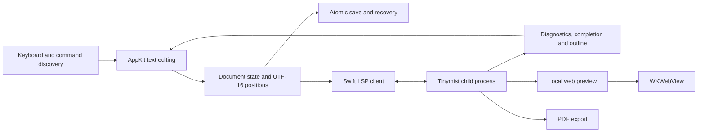

# LeftBlank architecture

The architecture prioritizes native input, maintainability, offline writing and reuse of Tinymist. Integrations follow the observed behavior of pinned versions rather than assumptions about undocumented protocols.

## Platform and packaging

- Swift 6.2 or later (Xcode 26 or later) and macOS 14 or later, with arm64 builds.
- Swift Package Manager separates core logic, the importable app library and a thin launcher so tests exercise production app code.
- AppKit owns windows, menus, dialogs and text editing; SwiftUI composes layouts, lists and command interfaces.
- Tinymist **0.15.8** is built from its pinned upstream commit with LeftBlank's checked-in patches (macOS native TLS and a VFS revision fix) and bundled with every Mac edition. It contains Typst 0.15.1.
- The running app needs no Rust toolchain, Homebrew or separate Typst installation. Uncached external packages may require a network download; cached packages work offline.
- A small local set of Phosphor icons is bundled with its license.

## Data flow

## Document state and storage

There is one active editing buffer. Navigating from the main document into an included file preserves the main compilation entry; the child buffer is opened before the main file when synchronizing with Tinymist. Explicit opening or saving under a new name establishes a new entry.

Document state includes file URL, main URL, source, monotonic revision, selection, saved baseline and diagnostics. Untitled documents use an app-managed draft location. Changing location updates the resource root and LSP document identity.

Asynchronous results are checked against document revision, selection and service session. Compilation state comes from Tinymist notifications. Versioned diagnostics are filtered; some notifications in the pinned server omit a revision, so fast typing can briefly show the previous round's feedback. Diagnostics are not claimed to be perfectly synchronized with each keystroke.

Writes are atomic. Autosave checks the on-disk baseline first and stops when another application changed the file. Local work remains recoverable, with reload and save-as available. Shutdown flushes recovery data; unsaved text must not exist only in a view.

## Native editing

`NSTextView` and `NSScrollView` send small editing events to the workspace. Ordinary typing does not rebuild the view, replace the whole buffer or steal first responder.

Positions use Foundation `NSString` / `NSRange` UTF-16 units, consistent with the negotiated LSP encoding. Tests cover Chinese, emoji, combining characters, CRLF and end-of-document positions.

Full-buffer replacement is reserved for opening, external reload and deliberate formatting. Highlighting changes attributes without creating undo operations. Marked text delays styling and completion application. Insertion uses `NSTextView.insertText(_:replacementRange:)` and a single undo group. Because AppKit may create its undo manager only after the first edit, observation attaches at edit time and synchronizes workspace state after undo/redo completes.

`SourcePresentation` returns original UTF-16 ranges and conservatively excludes code, comments and math. It styles headings, emphasis and inline code; the active paragraph reveals its full source while other markers shrink and fade. It never substitutes text or changes saved/copied content. This optional visual layer is not a semantic parser or compilation result.

Indentation and comments use text-range transformations. Formatting uses the real LSP response with revision, session and range validation.

## Command discovery

One registry holds stable IDs, English source labels, translated labels, bilingual keywords, groups, group keys, help, parameters, direct shortcuts and actions. Browsing and search share this registry. Labels resolve dynamically; the normalized search index includes both languages and stays valid through interface-language changes.

The panel has closed, category, search and parameter-entry states. `⌘J` toggles it, letters enter categories, `/` begins search and `Esc` returns through levels. Ordinary spaces and input-method candidate keys are not intercepted during editing.

| Group | Key | Examples |
|---|---|---|
| Insert | i | Headings, images, tables, equations, code, links, notes |
| Text Style | s | Bold, italic, highlight, selection wrappers |
| Page Setup | p | Paper, margins, fonts, page numbers |
| Mathematics | m | Basic operations b, structures s, symbols y |
| Typesetting | l | Columns, grids, alignment, containers, spacing |
| References | r | Bibliography, citations, contents |
| Editing & Code | c | Editing, modules, variables, Universe, formatting |
| Workspace | v | Writing, split, preview, outline, checks, text size |
| Documents | f | Create, open, save, save as, PDF export |

Commands produce explicit text transformations and placeholder ranges. They do not independently write files or refresh preview. String parameters are escaped; numbers and enumerations are validated. Real Typst compilation verifies the insertion catalog.

Insertion queries Tinymist for both selection endpoints. Math helpers accept one mathematical region and omit outer `$` delimiters there; body commands reject math, code and raw-text positions. Explicit inline/block/preamble metadata controls placement. Document settings follow contiguous `#set` rules at the start of a file, without rewriting arbitrary functions or `#show` scopes; later rules can still override them.

`WritingWindow.sendEvent` uses AppKit's normal dispatch path and responder chain. There is no application-wide `NSEvent` monitor or `MainActor.assumeIsolated` shortcut. File dialogs suspend main-window command handling.

## Logging and package discovery

`ActionLog` writes local JSONL with a lock protecting the file handle, sequence and rotation. Files rotate at about 1 MiB, retaining three archives. Each launch has a session ID. Logs record actions and control keys; ordinary typing is only `text`. Source, clipboard, queries and parameter values are excluded. Logging failure never blocks editing or saving.

`UniverseCatalogStore` reads metadata from `packages.typst.org/preview/index.json`. Numeric semantic-version comparison chooses each package's latest version; names and versions are validated before generating pinned imports. An atomic JSON cache has a 24-hour TTL, offline fallback and explicit refresh. Packages requiring a newer compiler display the requirement and cannot be imported through the browser. Browsing does not execute packages; Tinymist resolves them after an explicit import. Injected transport and state let tests use fixed indexes without depending on network availability.

## Tinymist lifecycle

Foundation `Process` launches the bundled executable. stdin/stdout carry framed LSP JSON-RPC; stderr is drained separately without persisting document logs. The client handles Content-Length framing, fragments, multiple frames, request IDs, initialization ordering, timeouts and process cleanup.

After `initialized`, `didOpen` and `didChange` synchronize buffers. File switches and reconnects end the old independent process session before opening the current documents. Full-text sync favors correctness; short debouncing limits work, and save/export flush the latest revision. The app integrates diagnostics, completion, document symbols, contextual help and go-to-definition. On Mac, Command-click, F12 and the definition command share `textDocument/definition`; the client advertises location-link support. Pending navigation is invalidated by selection changes, edits, document switches or a newer assistance request. Definition navigation retains the compilation entry and return positions, and package source remains read-only.

A workspace command starts preview on loopback with random ports. Actual commands, returned fields and synchronization channels are verified against the pinned server. Preview lifetime follows document lifetime. A crash keeps the buffer intact and offers reconnect; there is no unbounded automatic retry.

## Preview and export

`WKWebView` hosts Tinymist's bundled Web/SVG renderer. Local preview navigation stays constrained; external links open in the system browser. The page receives no unrestricted native bridge.

Writing, resizable side-by-side and full preview share the main file, resource root and fonts. Zoom changes the preview page container width and triggers layout; percentages are relative to fit-to-pane width. Preview failure does not cover the editor.

`--partial-rendering=true` renders visible regions. Tinymist repaints them only 500 ms after scrolling stops, so the injected adapter paints documents of up to 20 pages completely; longer documents paint one viewport ahead on each side and repaint while scrolling, no more than once per 100 ms and never sooner than twice the last render time. Because each repaint renews Tinymist's 600 ms resize anchor, the adapter drops that anchor once the reader has scrolled away from it, so dragging a scroll bar right after a resize is not pulled back. Invalid source preserves the previous successful pages and marks them stale; a first failed compilation has no page to preserve. Dark reading uses the pinned frontend's `invert-colors` and `normal-image` classes, maintaining the preference through server-driven class changes. It affects neither compilation input nor PDF export. Real WebKit tests verify retention, recovery, zoom and color state.

Source/preview navigation uses `tinymist.scrollPreview` and LSP `window/showDocument`. The returned file and range determine navigation, including included documents. Preview jumps count columns in Unicode scalars, unlike LSP results. A string value has no source span, so text a function displays from a parameter jumps to that parameter in the function body. The shared preview script reports the clicked text run and its line; when the jump lands on a parameter, `PreviewCallSite` moves it to the argument of the call in the same file whose string or content literal contains that text, or to the only call. Ambiguous or unmatched clicks keep Tinymist's location.

Export flushes the latest main-document buffer, waits for a valid result and copies it to the chosen destination. Compilation failure cannot report an old PDF as new. The exported revision is tracked; if editing continues during export, the result identifies the version captured when export began.

## Visual and performance conventions

Appearance defaults to **Match System**, with persistent **Light** and **Dark** choices in Settings. Light uses Nano-inspired white paper (`#FFFFFF`), blue-grey ink (`#37474F`), pale surfaces (`#FAFAFA`, `#ECEFF1`) and a restrained violet accent (`#673AB7`). Secondary and muted text use darker blue-greys for readable small labels; decorative greys do not carry essential text. The palette references [Nano's light theme](https://github.com/rougier/nano-emacs/blob/master/nano-theme-light.el) without importing its implementation.

Native dynamic `NSColor` values serve SwiftUI surfaces, AppKit controls and TextKit's existing syntax runs. System appearance changes repaint in place; no text replacement, syntax rescan, layout rebuild or undo entry is needed. The app-level choice also covers settings, toolbar, popovers and the preview canvas. The preview document's independent Light/Dark control still leaves PDF output unchanged. The small preference joins existing iCloud reconciliation.

Dark retains charcoal surfaces, warm white text and a low-saturation warm accent. Its colors are background `#171A1D`, editor `#1C1F23`, panel `#22262B`, border `#343A41`, text `#E0E2E5`, secondary `#9DA6B2`, accent `#D9B97C`, success `#A3BE8C` and error `#E29A9A`.

Use system interface fonts, monospaced shortcuts and source, and system CJK fallback. Text begins at 16 pt with adjustable size and a comfortable centered line width. Native `NSToolbar.unifiedCompact` keeps system traffic lights, document title and actions in one row. The status bar is about 30 pt high; command discovery uses a fixed 320 pt bottom panel. Compact hover hints size to their content. Phosphor Regular actions use consistent 16–18 pt icons.

The outline overlays the margin without changing manuscript geometry. Direct shortcuts and discovery paths share metadata. Document metrics cache a UTF-16 line index per revision. Source/readable-style snapshots update only the old and new active paragraphs when the caret moves; source or style changes rebuild them. Icons, normalized search, result sets, examples and key paths are cached. See [measured results](interaction.md).

## Tests and delivery

Functional tests use production windows, text views, workspace, WebKit and Tinymist together. They cover command discovery, insertion/undo/redo, files, conflicts, recovery, diagnostics, preview and PDF contents. Boundary tests complement those flows with UTF-16, framing and parameter validation. Tests need no database or container.

Coverage merges test-bundle profiles and deduplicates LCOV file/line records. All first-party production Swift must be accounted for; missing files fail the report, and overall coverage must reach 80%. Raw LLVM JSON, LCOV, file summaries and HTML remain available. Coverage does not replace behavioral assertions or real visual checks.

Local scripts keep downloads, build outputs and test data on the SSD checkout. `build/LeftBlank.app` has a development signature. Release scripts import a Developer ID identity into a temporary keychain, sign helpers and the app, notarize, staple and validate with Gatekeeper. Release commits must already belong to main, and version tags must match `Info.plist`. Missing credentials or failed validation stop publication. See [signing](signing.md).

GitHub Actions uses macOS 15 arm64 runners, pinned action commits and pinned dependency checksums. PR/main jobs run functional tests, coverage and release builds. Version tags rerun verification, produce an arm64 ZIP plus SHA-256, and publish a GitHub Release. Permissions are limited to each job's needs.

## Risks and references

The preview protocol includes extension APIs, so pinning and real integration tests matter. AppKit/SwiftUI synchronization must preserve input methods, focus and undo. Main-file identity must remain explicit across included documents. External packages, images and fonts depend on real filesystem context shared by preview and export.

References: [Tinymist preview](https://myriad-dreamin.github.io/tinymist/feature/preview.html), [Tinymist source](https://github.com/Myriad-Dreamin/tinymist), [NSTextView](https://developer.apple.com/documentation/appkit/nstextview), [WKWebView](https://developer.apple.com/documentation/webkit/wkwebview), [Nano Emacs](https://github.com/rougier/nano-emacs), [Phosphor](https://github.com/phosphor-icons/core), [CotEditor testing](https://github.com/coteditor/CotEditor/blob/main/.github/workflows/test.yml), [CodeEdit testing](https://github.com/CodeEditApp/CodeEdit/blob/main/.github/workflows/tests.yml), [GitHub hosted runners](https://docs.github.com/en/actions/reference/runners/github-hosted-runners).

## Library and localization (0.4)

The library actor owns UUID-based folders and coordinated filesystem operations; LibraryController connects navigation to the live Workspace. UI titles are metadata, while source and assets retain stable relative paths. A conservative background three-way diff incorporates non-overlapping remote edits through native undo. Native iCloud conflicts block overwrites. See [library and sync](library-and-sync.md) and [merge evaluation](merge-evaluation.md).

Localization uses native resource bundles and observable language changes without replacing the editor. Explicit package imports in the [Code notes template](code-notes.md) keep exported source portable.

### Book-length WebKit preview

The pinned Tinymist 0.15.8 frontend combines partial SVG pages with an optional
canvas fallback inside SVG foreignObjects. With SICP this creates hundreds of
canvas surfaces under a root SVG over a million CSS pixels tall at wide-window
zoom. Real-window acceptance exposed incorrect/blank composition. LeftBlank disables
that optional `feat$canvas` mixin on registered preview documents and retains
Tinymist's viewport-driven SVG patches, source mapping and continuous scrolling.
This is a version-specific frontend adapter; the complete-book preview integration
test checks the pinned DOM contract, zero canvas fallback surfaces, distant-page
SVG content and WebKit snapshots. Revalidate the adapter on engine upgrades. A terminated WebKit content process
gets one automatic reload; a repeat failure displays a reconnect message.
