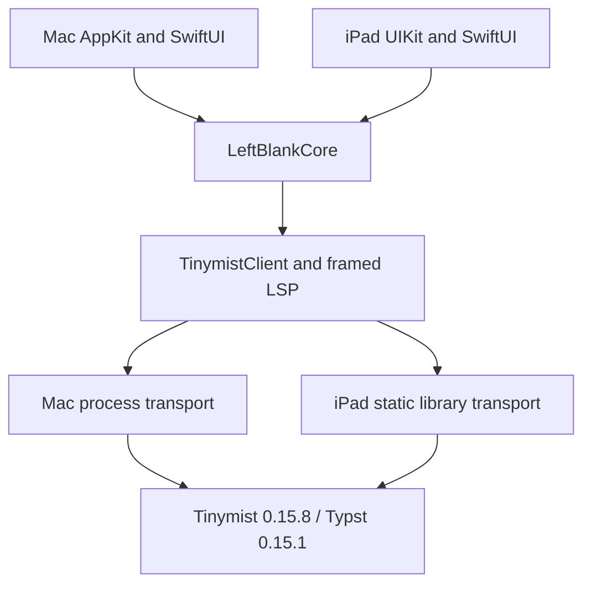

# Mac and iPad architecture and parity

## Shared core, native presentation

The goal is the same document behavior and design language on both platforms.
Keep business rules in `LeftBlankCore`; keep AppKit/UIKit views, native editor
integration, lifecycle and engine startup in their platform targets. Native
layout adapts to window size and input methods. Templates and packages do not
need separate discovery, installation or caching implementations for iPad.

| Layer | Shared implementation | Platform responsibility |
| --- | --- | --- |
| Documents | `DocumentLibrary`, conflict-aware saves, recovery and history | File pickers, library navigation, background save |
| Editing | Commands, insertion plans, syntax presentation, `DocumentMetrics`, UTF-16 positions | `NSTextView` / `UITextView`, selection, IME, undo and focus |
| Templates and packages | `UniverseBrowserModel`, catalog/discovery, template installer, bounded thumbnail download/cache | Gallery layout and NSImage / UIImage decoding |
| Typesetting | `TinymistClient`, framed LSP, diagnostics, formatting, PDF export | `ProcessTinymistTransport` / `EmbeddedTinymist` |
| Preview | Tinymist frontend, `PreviewScripts`, source-location decoding | Native WebKit host, sizing and editor reveal |
| Design | Phosphor PDF icons, localized copy, syntax palette | Platform colors, toolbar and touch targets |

This follows Apple's support for [sharing code across platform targets](https://developer.apple.com/documentation/Xcode/configuring-a-multiplatform-app-target).
It is an architectural choice, not a claim that Apple requires this exact split.
The platform workspaces still contain presentation orchestration; future features
should extend shared services rather than copy business rules into both workspaces.

The Mac Swift package uses the repository's `Package.swift`. The iPad Xcode
project points to the fixed core-only manifest in `Sources/Package.swift`, which
compiles the same `Sources/LeftBlankCore` files and resources. Its only package
dependency is ZIPFoundation; the UI test target separately uses Nimble. iPad
does not resolve or compile the Mac app or Sparkle updater. The shared engine
process transport is also guarded with `os(macOS)`.

The manifests use the same package and target names to preserve the generated
resource bundle identity. iPad's graph stays fixed even when
`LEFTBLANK_DISTRIBUTION=preview` is present in the host environment. Checking the
host operating system in one manifest would not distinguish an iPad destination:
Xcode evaluates both manifests on a Mac. `scripts/test-package-graphs.py`
evaluates both real manifests in standard and preview modes without dependency
downloads, and verifies the iPad project and dependency lock against this boundary.

## Agent tools and the macOS MCP boundary

The [MCP design and implementation status](mcp-design.md) separates shared Swift
business tools from macOS transport. Tool schemas, document operations, revision
checks, patches and history live in `LeftBlankCore` without any MCP SDK import.
The iPad test target also runs their shared core tests. A future embedded agent
can call this dispatcher directly through a UIKit workspace adapter; neither app
currently contains model inference or an agent loop.

`MCPConnection`, its Settings section, the Rust `rmcp` helper, HTTP listener,
private IPC, credentials and setup prompt belong to the Mac target and packaging
scripts only. iPad must not resolve, compile, link or bundle them. Package graph
checks and the post-build iPad artifact check enforce this boundary. The existing
Tinymist Rust static library remains unchanged; this is not a ban on Rust or Tokio.

A future iPad agent must stop scheduling new steps when suspended, preserve
applied edits and recheck revisions and uncertain operation results on resume.
It does not require a localhost MCP service or a persistent background daemon.

## Why Mac still runs an engine process

iPad embeds Tinymist as a Rust static library. Its background worker and pipes
carry the same LSP messages as Mac, without replacing application stdin/stdout or
changing the app's working directory. Mac packages and starts a Tinymist helper
executable. Both use the same engine generation and shared Swift client.

Embedding does not remove the Typst compiler or intentionally restrict its
typesetting features. It also does not establish equal speed, memory use or
recovery behavior. The iPad bridge currently uses two Tokio workers and a
size-optimized release build; there is no controlled comparison with Mac's
upstream executable. Platform fonts can also change pagination.

Keep Mac's process boundary for now: an engine crash can terminate the helper
without terminating the editor, and its memory has a separate lifetime. Apple's
[XPC guidance](https://developer.apple.com/library/archive/documentation/MacOSX/Conceptual/BPSystemStartup/Chapters/CreatingXPCServices.html)
describes process isolation as a stability technique; our current helper uses
`Process`, not XPC. An embedded engine shares the app's failure and memory domain.
The Rust bridge catches unwinding panics at its entry point, but that does not
isolate an abort or a fatal worker failure.

Before changing Mac's transport, compare both transports on the same Mac, engine
revision, fonts, documents and release settings. Measure cold and warm startup,
first preview, edit-to-preview p50/p95, PDF export, combined app/engine/WebKit peak
memory, repeated document switches and failure recovery. Then run representative
books on iPad and test background suspension. Use the same output checks in both
cases. Apple's [performance workflow](https://developer.apple.com/documentation/xcode/improving-your-app-s-performance/)
supports measurement before optimization. Small-document correctness tests are
not a substitute for these measurements.

## Independent builds and releases

| Platform | Build and validation | Distribution |
| --- | --- | --- |
| Mac | SwiftPM, `scripts/test.sh`, existing Mac CI and book benchmarks | Existing signed preview and Mac release workflows |
| iPad | Xcode target, `scripts/build-ipad.sh`, iPad jobs in `.github/workflows/ci.yml` | `ipad-v*` release tags start production signing, upload and storefront preparation |

One `build and test` workflow contains Mac and iPad validation, and selects
each platform's jobs from the changed paths. Mac regression
and nightly App Store distribution validation run independently. PRs and main
pushes avoid the distribution rebuild; the nightly run checks it before
Preview packaging. The iPad build matrix runs engine
integration, simulator compilation and device compilation in parallel, using
independent engine caches. It produces the simulator test Products once and
passes them to a two-size UI matrix. Each size runs the full suite on its own
standard macOS runner; no runner boots two iPads. Each command has a timeout,
and failed boot/test operations save resource diagnostics. CI device
builds are unsigned; simulator tests do not establish physical-device performance.

The current main-branch ruleset requires `build and test` and 80% coverage, but
has no separate iPad check requirements. The existing `build and test` check now
aggregates Mac regression, Mac App Store validation, Mac memory safety, all
iPad builds, the UI sizes, iPad coverage and independent memory checks. A
failed, cancelled or unexpectedly skipped prerequisite cannot produce a
successful aggregate. It accepts only expected skips: jobs the path selection
did not choose, full-suite iPad jobs outside the nightly or a full dispatch, and
the App Store and Mac memory jobs outside nightly and manual main runs. This PR does not change repository rules. The nightly Mac preview
still depends on Mac validation; platform release targets remain independent.

Existing Mac release tags do not publish an iPad build. Apple supports adding an
[iOS platform to the same app record](https://developer.apple.com/help/app-store-connect/create-an-app-record/add-platforms)
with the same bundle identifier and independently selected platform versions and
builds. The iPad app uses the Mac App Store bundle identifier and iCloud container.
The separate iPad archive/export/upload pipeline and initial `1.0.0 (1)` release
metadata are described in [ipad-app-store.md](ipad-app-store.md). The pipeline
prepares the iOS record, subscription and production profile using existing
credentials. Apple requires the first subscription to be submitted with the app
through the website; the pipeline records this handoff rather than claiming
submission. Later releases can submit through the API after subscription approval.
Development signing does not validate production signing or Apple review.

## Current parity and remaining validation

| Area | Current iPad behavior | Remaining work or evidence |
| --- | --- | --- |
| Local typesetting and PDF | Live preview, native PDF sharing, source/project export and AirPrint | Matching fonts/assets required for equal pagination; large-book performance needs device measurement |
| Project navigation | Browse project sources, choose any `.typ` import entry, edit included files, follow local/module/package definitions and return with Go Back or ⌘W; package sources are locked read-only | Cross-library chapter references are not exposed |
| Source/preview navigation | Preview taps open the corresponding project source; explicit caret-to-preview reveal waits for compilation | Source positions use UTF-16; preview protocol columns use UTF-8 |
| Editor assistance | Inline completion, pointer hover and explicit signature/documentation help, rendered examples, context actions, formatting, snippets and hardware keyboard shortcuts | Completion supports plain text and simple numbered placeholders; variable/transform snippets and file-creating code actions remain unsupported |
| Resources | Import or reuse project images, bibliography and local Typst files; paste screenshots and drop images | Resource imports copy files; dependencies of a standalone `.typ` file require project import |
| History and recovery | Per-source history, highlighted before/after comparison, undoable restore, hourly/daily snapshots, asset-preserving recovery | History stays on this device; background/relaunch recovery still needs prolonged physical-device testing |
| Native workflows | Independent windows and recovery files, content search, print, appearance settings, recoverable trash and confirmed Empty Trash | AirPrint output and Stage Manager need manual device verification |
| Cloud/lifecycle | File-presenter and iCloud discovery, foreground refresh, conservative three-way merge, conflict protection | Real Mac/iPad delivery, account transitions and suspension need physical-device verification |
| Input/accessibility | Native UIKit editor, Dynamic Type font scaling, touch targets, keyboard commands and IME guards | Chinese IME, VoiceOver and full hardware-keyboard workflows need manual verification |

Each window owns its editor, engine connection and export directory. Restored scenes
reuse their recovery identity. Windows share the history actor to serialize snapshot
updates. Close other windows before switching the library between local and iCloud storage. External changes merge only when the shared merge
algorithm can preserve both edits. Overlapping edits retain the unsaved buffer
and recovery snapshot and block destructive saves.

AI probes and planning files have been removed. No model runs in either app.
Hosted validation and physical-device checks establish different boundaries;
compilation alone does not establish editing quality or cross-device reliability.

Pointer help uses the shared hover parser and symbol boundaries. Example previews use a separate embedded Tinymist session and temporary root, retain the manuscript session, cache up to 16 images, and stop the session after five seconds or cancellation. Unlike the Mac subprocess, an embedded worker cannot be forcibly terminated; pathological example compute still needs device profiling. Native simulator tests exercise rendered pixels, embedded images, isolated file access, package read-only navigation, return positions, and hover focus/scroll behavior. Hardware pointer and keyboard behavior still needs physical-device verification.
