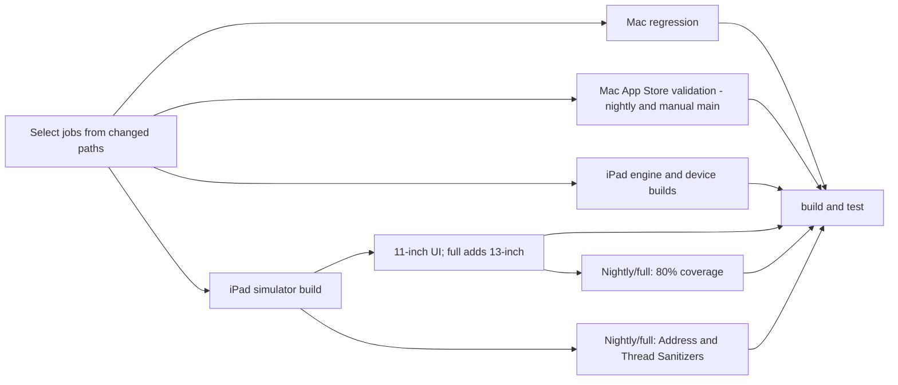

# iPad development

The native iPad target requires iPadOS 17 or later and Xcode 26.3 or later. Open
`iPad/LeftBlank.xcodeproj` and use the **LeftBlank-iPad** scheme. Set the signing
team before installing on a physical iPad; the app uses the same bundle identifier
and iCloud document container as the Mac App Store target.

## Shared behavior

The app shares document storage, conflict-aware saves, recovery snapshots,
revision history, built-in templates, command insertion, package discovery, SICP
import, Typst diagnostics, formatting, and PDF export with the Mac implementation.
Tinymist 0.15.8 / Typst 0.15.1 is pinned to the same engine generation as Mac.

On iPad, Tinymist runs as a Rust static library on a background worker, with the
same framed LSP and local WebKit preview. It does not launch an executable. Pipes
connect the Swift client to the engine without replacing application stdin/stdout
or changing its working directory. The same library carries LeftBlank's
typst-syntax parser bridge, which the app hands to `SyntaxTree.install` at launch
([parser bridge](visual-editing.md#parser-typst-syntax-through-a-c-abi)), so the app links one Rust runtime. Each
document connection owns its worker and runtime. Closing the client delivers EOF and shuts down that worker. The embedded
build applies `scripts/tinymist-ipad.patch` to the verified upstream revision:
compile-status notifications tolerate a closed editor channel when a Rayon
compilation finishes after shutdown. This prevents a process-wide panic during
document switching. `scripts/tinymist-ipad-export.patch` makes explicit exports
use the latest LSP buffers, including unsaved included files, even while the
compiler is processing a close/reopen filesystem invalidation.
`scripts/tinymist-vfs.patch` gives each virtual-filesystem revision its own
unread file cells. Otherwise a compile still reading the previous revision could
fill a cell shared with the next one after its path index was copied; later edits
to that file then never invalidated it, so export and preview kept stale
include contents. The integration test immediately exports repeated edits
without waiting for preview and verifies that closing an included file restores
its saved contents. The Mac helper is built with the same VFS patch. The source
stays in the workspace's `.tools` directory; the iPad-only patches do not reach
the macOS CLI or the shared Cargo source cache. CoreText
font URLs are copied into an application cache and explicitly included in LSP
initialization, so package-cache options cannot replace the font search path.
Typst's default fonts are also embedded as a fallback. Identical pagination still requires the same fonts and assets on both
platforms; platform system font sets may differ.

The shared core also bundles Noto Sans SC as a portable Chinese fallback.
On the physical iPad, `PingFangUI.ttc` contains Apple-specific `cidg` / `hvgl`
glyph tables without standard TrueType/CFF outlines, so Typst cannot use it.
The welcome template retains Libertinus Serif and PingFang SC first, with Noto
last. Existing Mac typography and app interface fonts remain unchanged; iPad
Chinese text can use Noto offline. An unavailable explicitly named system font
can still produce a warning. Older manuscripts retain their font declarations.
The welcome document now copies its relative SVG asset during both first launch
and template creation. Opening an older LeftBlank starter repairs a missing mark
without replacing an existing asset or rewriting the manuscript.

The UIKit editor is a TextKit 2 `UITextView` with the Mac's styles
([editor styles](visual-editing.md#the-editor-now)): larger bold headings by
level, bold strong text, italic emphasis, monospaced raw text and semantic
colours, all as attributes on the source. Taps and jumps use the laid-out viewport,
because UIKit's own hit testing can be 100,000 characters off after a distant
jump. On an iPad Air (M1), SICP types in 33–48 ms per key and War and Peace
in about 100 ms. It preserves native selection, IME composition, undo, find,
keyboard and trackpad behavior. Wide detail panes offer writing and preview side
by side; narrow multitasking windows and portrait layouts switch between them.
The library uses native navigation, menus, document pickers, sheets and sharing.
Keyboard shortcuts include save, command discovery, outline and PDF export.

The library header keeps its title on a separate line and uses the shared
Phosphor assets for search, discovery, library actions and the sidebar toggle.
Built-in documents and the SICP sample book live inside template discovery.
Search hints follow the template/package mode, and category icons come from the
shared Mac/iPad definitions. Native menu labels use image values so their action
titles remain available to accessibility. Both split-view columns declaratively
remove the default sidebar toolbar item, leaving the shared Phosphor control
through document creation and layout changes.

On iPadOS 18 and later, discovery presentation sizing follows the actual app
window, capped at 1120 points wide and 1100 points high. iPadOS 17 uses a full-screen
presentation. Gallery columns adapt to the available width. At 1000 points or
wider, selecting a template or package opens a 360-point detail pane beside the
catalog; narrower windows show detail with a back-to-results action. Selection
and search survive rotation across this breakpoint. The action bar stays visible
below the scrollable detail content.

## Editing parity

Mac and iPad share the typing-context scanner, completion selection model, object
parser and form, and preview reading script. Each platform keeps native editor
focus, IME, keyboard, touch or pointer behavior, and undo integration.

- Completion appears inline after typing pauses. Hardware keyboards can select
  candidates with arrows and Tab. Touch targets are at least 44 points on iPad.
  Multiline function calls receive parameter help. Escape dismisses assistance.
- **Edit Table or Image…** updates a supported object at the cursor. Table rows,
  columns, cells, TSV paste, and image resource/width/caption/alignment editing
  use the same validation on both platforms. Unsupported syntax stays in source.
- Preview controls provide **Follow Writing**, **Return to Reading**, and zoom.
  User scrolling pauses follow mode. Page-relative anchors survive scale and
  layout changes, but do not track paragraph identity through document reflow.

Shared tests cover UTF-16 ranges, stale snapshots, parsing limits, and reading
state. Mac tests use AppKit and the real Tinymist process. iPad tests use UIKit,
the embedded engine, and native undo. Both clients test reading anchors in real
WKWebViews. iPad UI tests cover automatic suggestions, existing-table editing,
undo/redo and compilation on both supported simulator sizes in main CI.

## Build and validation

Run from an SSD-backed worktree under `/Volumes/SSD/Developer`:

```sh
scripts/test-ipad-engine.sh
scripts/build-ipad.sh simulator
scripts/build-ipad.sh device
scripts/lint.sh
```

These scripts install Rust 1.92.0 and keep dependency sources and targets on the
external development volume. Cargo.lock includes upstream's Typst and preview
patches; do not replace them with unpatched crates.io releases. The app builds
link the static engine for the selected SDK. Builds are unsigned by default.

The engine integration probe runs the C bridge in a native host executable. It
checks initialization, Unicode edits, outline updates, live preview HTTP, PDF
export from an unsaved buffer (including actual text drawing commands), and
orderly shutdown and EOF during active compilation while the host stays alive. It establishes engine and
transport behavior, but does not replace iPad runtime testing.

The UI test target checks editing, autosave, preview switching, rotation, command
insertion, preview-to-source navigation, template discovery, package import and
PDF sharing, plus English and Chinese welcome rendering. Run it with an available
iPad simulator:

```sh
xcodebuild -project iPad/LeftBlank.xcodeproj -scheme LeftBlank-iPad \
  -destination 'platform=iOS Simulator,id=<iPad simulator UUID>' \
  -derivedDataPath build/iPad -clonedSourcePackagesDirPath .build/xcode-packages \
  CODE_SIGNING_ALLOWED=NO test
```

Mac and iPad share one `.github/workflows/ci.yml` workflow. Its first job
selects Mac and iPad jobs from the changed paths (see the
[CI capacity policy](development.md#ci-capacity-policy)): changes under `iPad/`,
`Engine/TinymistBridge` or iPad-only scripts skip Mac regression, Mac-only changes skip every
iPad job, and shared code runs both. When selected, Mac regression and Mac App
Store validation (nightly and manual main runs) run alongside the iPad engine, device and
simulator builds. The simulator build produces the tests every UI job runs.
iPad validation has two depths:

- **Smoke** (pull requests, main pushes, or `workflow_dispatch` with
  `ipad_suite=smoke`): one 11-inch/light UI job runs every native unit test
  plus the curated UI scenarios in `SMOKE_TESTS` (`scripts/ipad_simulator.py`):
  writing, split view, autosave, preview, rotation, Welcome rendering and PDF
  sharing. The whole pull-request workflow is designed to finish within ten
  minutes.
- **Full** (the nightly schedule at 18:00 UTC, or `workflow_dispatch` with the
  default `ipad_suite=full`): 11-inch/light and 13-inch/dark UI jobs run every
  UI scenario and record memory metrics. Separate Address Sanitizer and Thread
  Sanitizer jobs compile their own products and run the native unit tests in
  parallel, and the 80% iPad application coverage gate merges both UI results.
  The nightly run skips only a commit that already had a fully successful
  nightly, so a full-suite regression is reported up to a day after it merges.

The existing `build and test` check aggregates Mac and iPad results and rejects
failed, cancelled or unexpectedly skipped prerequisites. Jobs the path selection
did not choose must be skipped. Smoke runs require the full-only coverage and
sanitizer jobs to be skipped; full runs require them to pass. PRs and main
pushes expect the App Store and Mac memory checks to be skipped; nightly and
manual main runs require them to pass. Mac regression tests remain in `scripts/test.sh`.
Platform build/release boundaries, engine tradeoffs and the feature-gap
inventory are in [ipad-architecture.md](ipad-architecture.md).



Successful compilation is cached before UI testing, so a failed UI test does not
discard the Rust build. Cache uploads are bounded and optional. The simulator
build produces an `.xctestrun` bundle once. Its Products directory is
transferred in a compressed tar archive, preserving executable permissions and
symlinks. The intermediate artifact is retained for one day. UI runners
consume this same build without resolving or rebuilding packages. Each
invocation of `scripts/ipad_simulator.py --size <11-inch|13-inch>` selects and
boots only its requested size on the newest available iOS runtime, then shuts it
down after testing. The two sizes cannot compete for resources on the same
machine. A disposable simulator boots, receives its appearance, shuts down and
boots again before testing: an iOS 26 first boot can leave rotation broken and
ran tests measurably slower.
Each UI runner selects Xcode 26.3 system-wide as well as through `DEVELOPER_DIR`
before contacting CoreSimulator. Its first device query has a three-minute
limit for service initialization and runtime mounting; later inventory checks
retain a 30-second limit. This is an upper bound, not a fixed wait.
Boot readiness is limited to four minutes, test startup to ten minutes, UI
execution to 25 minutes for the full suite and ten for smoke, and shutdown to
two minutes.
Boot monitoring prints migration progress. Failures include bounded device,
memory, process, Xcode and CoreSimulator service diagnostics, including failures
during initial device discovery; results are saved separately for each size.
Shutdown failure fails that job. Timeouts kill the command's process group before
cleanup. Offline lifecycle contracts run in the engine job.
Xcode verbose test diagnostics are disabled because automatic sysdiagnose can
add a ten-minute wait after a failure. Test reports, recordings and attachments
remain in the result bundle; the helper collects the bounded diagnostics above.
Tests retain 150/180-second default/maximum per-test allowances. Each case stops
at its first failure; the suite still runs every selected case and terminates
the app after each one.

UI scenarios launch with `-iPadOpenTemplate <blank|welcome>`, which opens a fresh
built-in document directly. Template discovery still starts from New Document
and the real gallery. Waits poll five times per second rather than through
XCTest's once-per-second predicate expectations.

## Current evidence and remaining work

GitHub [run 37021201574](https://github.com/leftblank-app/leftblank/actions/runs/37021201574)
passed Mac regression and all three iPad engine/simulator/device build jobs.
Both independent iOS 26.2 UI runners completed six cases, with five passing.
Only the Chinese welcome case failed: after the first document creation, the
system sidebar button appeared beside the custom Phosphor button. The failure
recording confirmed the duplicate. The former UIKit lifecycle configuration was
replaced with SwiftUI's `toolbar(removing: .sidebarToggle)` on both columns.
The test retains its absence assertions and now attaches a screenshot and view
hierarchy when duplicate controls appear.

Earlier failures had separate causes: run 37018624799 exceeded the old 30-second
cold simulator discovery limit; run 37020341577 could not compile the iPad picker
after main #36 removed `AppLanguage.displayName`. Both were corrected, and the
latest hosted run successfully discovered devices and compiled both platforms.
A complete passing hosted run with the sidebar fix remains pending.

Local simulator verification uses Xcode 27.0 / iOS 27.0, rather than hosted CI's
Xcode 26.3 / iOS 26.2. CoreSimulator rejected device creation on the external SSD
with Cocoa error 513 / POSIX `Operation not permitted`. The user authorized only
simulator runtime/device data on the internal disk; source, dependencies, builds,
logs and results remain on the SSD. On October 2, 2026, fresh, task-owned iPad Air
(M3) simulators each passed all six cases: 11-inch in 217.5 seconds and 13-inch in
225.6 seconds (12 executions, zero failures or skips). These are test execution
times, excluding simulator boot and test-runner setup. On the 11-inch device, the package
search test initially tried to tap a card obscured by the software keyboard;
it now submits the search before selection, matching the template search flow.

The complete Mac regression previously passed with 85.99% application source-line
coverage. A focused Tinymist round trip verified the bundled Noto family and
Chinese PDF text. Embedded-engine integration, simulator build-for-testing,
device compilation, strict Swift lint, actionlint and ten offline simulator
lifecycle contracts passed. A real compiled Products archive was relocated and
verified for test paths, executable permissions, checksums and the bundled font.
Seven aggregate-gate outcomes passed, including the expected PR skip, required
main validation and failure propagation.

The six-test suite previously passed on a physical iPad Air 13-inch (M4), iPadOS
26.6.1, in 194 seconds. It covers selection replacement, autosave, live preview,
rotation, command insertion, undo/redo, preview-to-source navigation, template
and package discovery, package import, native menu accessibility, library title,
mode-specific search hints, catalog/detail state and native PDF sharing. English
and Chinese welcome screenshots were inspected for glyphs and layout. The
welcome PDF is two A4 pages with embedded font mappings and text drawing commands.
Tests disable iCloud and use local document storage.

Before shipping, manually verify Chinese IMEs, VoiceOver, Dynamic Type,
keyboard/trackpad editing, large books, background/relaunch recovery, preview
after suspension, and iCloud synchronization with a Mac. Compare PDF pagination
using matching fonts. Signed installation and UI tests do not establish all of
these behaviors.

The project importer now offers an entry-file picker when a folder contains
multiple Typst sources. Project Files opens included files while preview and PDF
export stay attached to the selected entry. Completion, contextual help, history
comparison, resource import, independent windows and printing are now implemented.
See [the current parity table](ipad-architecture.md#current-parity-and-remaining-validation)
for supported workflows and remaining device checks. Historical validation above
predates these additions.
