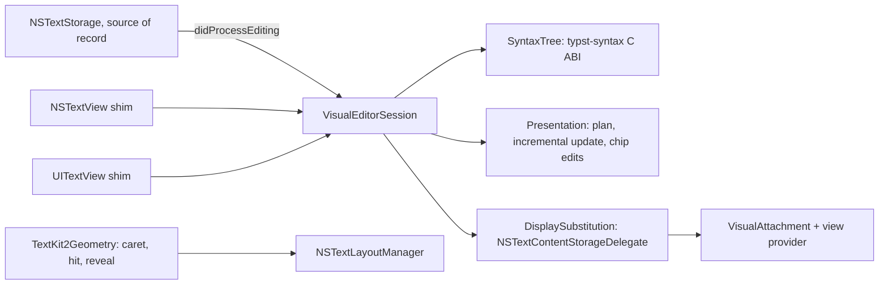

# Visual editing (LB-019 spike)

Evaluated on 2026-10-07 on an Apple M4 Pro, macOS 27.0, Xcode 27.0, and the
iPad Pro 11-inch (M5) simulator running iOS 27.0. This is a spike. The prototype
lives in [`Benchmarks/VisualEditing`](../Benchmarks/VisualEditing) and
[`Engine/SyntaxBridge`](../Engine/SyntaxBridge). No production target changes.
Every number below comes from `scripts/visual-editing-spike.sh` and was produced
by instrumented debug builds unless stated otherwise.

## Decision

**Build one TextKit 2 visual layer and share it verbatim between `NSTextView`
and `UITextView`.** Source stays the document of record. Outside the caret's
construct, an `NSTextContentStorageDelegate` returns a display paragraph with
the **same UTF-16 length** as the source:

- concealed markers become U+200B (zero width);
- a chip, image or math box becomes U+FFFC carrying an attachment, and the rest
  of its range becomes U+200B.

Because display and source locations map 1:1, TextKit 2's own selection, hit
testing, IME and editing ranges remain source ranges. `NSTextStorage` (save,
undo, copy, find, Tinymist) never sees a display character.

The presentation model comes from **typst-syntax** through a small C ABI. On the
iPad it is linked into the existing engine library; on the Mac it is a new
static library. The model is pure Swift in `LeftBlankCore`.

In the prototype, 94% of the visual-layer source compiles unchanged on both
platforms. The per-platform code is one ~45-line view shim on each side (§C).

TextKit 2 still has large-document gaps that this layer must work around (§B).
Jumps must not trust `scrollRangeToVisible`. iPad typing in multi-megabyte
books needs device profiling before visual editing is enabled there by default.
The TextKit 1 implementation of the same plan also works on both platforms
(measured). It stays as the documented fallback.

This supersedes the scope line in [editor-evolution.md](editor-evolution.md),
"Arbitrary Typst functions and package templates are not converted into visual
widgets". The new scope:

- Calls whose arguments are all literals, to functions with a visible `#let`
  signature, may render as chips, with a form editor generated from that
  signature.
- Calls that carry content (`#f[...]`), expressions or errors stay source.
- Equations follow the engine-rendered fragment direction in
  [editor-rendering.md](editor-rendering.md).

## Targets and how the layer maps them

| Target | Mechanism | Status in the spike |
|---|---|---|
| Headings, strong, emphasis, raw, links, refs, labels, list markers | Conceal marker units; style the rest; reveal when the selection touches the construct | Implemented and measured on both platforms |
| Function chips (`#item("LB-001", "标题", "done")` → `LB-001 标题 [已完成]`) | Replacement box via attachment view provider. Parameter names come from `#let item(id, title, status)`; value labels come from a formatter table | Implemented; form edit and "repeat previous call" are tested |
| Inline images | `#image("…")` replacement and an inline request carrying the path | Box geometry only; no decoding |
| Inline math | Equation request; a box once an engine fragment (size, baseline) is cached | Geometry path only; the engine API is the open question (§Risks) |
| iPad parity | The same adapter files compile for `UITextView`; the same tests run in the simulator | 18 behaviour and model tests pass on both; the 2 opt-in benchmarks run on both |

## A. Text system

### Concealment techniques, measured

Behaviour tests (`TextKit2BehaviourTests`, `TextKit1BaselineTests`) run on real
views in a real window, on macOS and in the iPad simulator. The sample mixes
CJK, emoji, a chip, a list and math.

| Technique | Hidden marker width | Backing string | Mapping and caret | Verdict |
|---|---|---|---|---|
| **TK2 same-length substitution (U+200B / U+FFFC)** | **0.0 pt** (Mac, iPad) | Unchanged | 1:1; hit tests round-trip on every visible character | **Chosen** |
| TK2 substitution, keep characters with a 0.01 pt clear font | 0.005 pt | Unchanged | 1:1 | Works, but it is today's hack moved into the display layer |
| TK2 length-changing substitution (delete markers) | n/a | Unchanged | Caret drifts by 17.3 pt (two characters); offsets at the paragraph end have no caret rect | Rejected: TextKit 2 reads display offsets as document offsets |
| TK2 custom `NSTextLayoutFragment` drawing | 8.65 pt (unchanged) | Unchanged | Unchanged | Drawing only; geometry cannot collapse. Use it for decoration, not concealment |
| TK1 null and control glyphs (`ConcealingLayoutManager`) | 0.0 pt (Mac, iPad) | Unchanged | 1:1 | Works; fallback |
| Current: 0.1 pt font on markers | about 0.05 pt | Unchanged | 1:1 | Replaced |

The same results hold for both TK2 rows on both platforms:

- **Chips.** Layout width equals the box (130 pt, both platforms). A tap in the
  middle resolves to the call's start through `NSTextSelectionNavigation` (both
  platforms) and through `UITextView.closestPosition`. `NSTextView`'s
  `characterIndexForInsertion` answers start + 1, which is inside the call. The
  selection then touches the construct and reveals it, so no snapping is needed.
  Attachment view providers are created only for an ordered-in window (0
  requests hidden, 6 visible). This matters for tests, not users.
- **Caret navigation.** With a static plan, `NSTextSelectionNavigation`
  (`destinationSelection`, the engine behind arrow keys on both platforms) moves
  from before `*粗体*` straight to the first visible unit inside it. The stops
  were [74, 75, 76, 77] from 72; it never rests on the hidden `*`.
  `NSTextView.moveRight` agrees (74). Entering any construct therefore reveals
  it, which is the Obsidian behaviour. Atomic chips that are never revealed
  would need custom navigation.
- **Instant reveal.** On a selection change, re-planning and rebuilding the
  affected paragraphs (at most 3) took 1.0 ms median on both the Mac and the
  iPad. That replaces today's 100 ms debounce. It creates no undo records.
- **Chinese IME.** The marked-text rect starts at the visible caret, next to a
  concealed chip: 247.5 vs 247.5 pt on the Mac, 242.5 vs 242.5 on the iPad.
  Plan updates are deferred while text is marked. The committed string is
  exact, and one undo restores the source.
- **Undo.** A form edit is one native replacement; one undo restores the call
  and its chip label. "Repeat previous call" produces `#item("", "", "done")`
  with two Tab placeholders.
- **Copy (Mac).** `writeSelection` copies source (`Text *粗体 bold* and`). Copy
  on the iPad was not exercised, because the simulator pasteboard can sync to
  the host. The backing storage is unchanged, so the same is expected.
- **Accessibility.** On the Mac, `accessibilityValue` is the source text;
  `UITextView` returned nil in the harness. On both platforms the range string
  is `*粗体 bold*`, so assistive technology
  reads the markup, not the display paragraph. Actual VoiceOver speech was not
  tested. Chip views are accessibility elements with the chip label.
- **TextKit 1 fallback is silent and permanent.** One `.layoutManager` access
  turns `textLayoutManager` into nil on both platforms. The Mac also posts
  `NSTextView.willSwitchToNSLayoutManagerNotification`. The migration must
  guard this (see the Mac migration path below).

### TextKit 1 on both platforms (baseline)

`ConcealingLayoutManager` uses `shouldGenerateGlyphs` (`.null`), a
control-glyph whitespace action with a custom bounding box for boxes, and
`shouldSetLineFragmentRect` for tall boxes. It is 197 lines and compiles for
both `NSTextView` and `UITextView(frame:textContainer:)`. Marker width 0, chip
width 130 = box, an IME rect at the caret, undo, copy and AX behave like TK2.

It is the lowest-risk way to share code if TextKit 2 fails the iPad gate below.
Its costs: `NSLayoutManager` temporary attributes are AppKit-only; it gives up
TextKit 2 viewport layout; and Apple's newer text features target TextKit 2.

## B. Large documents

`LargeDocumentTests` uses the real books from
[large-document-performance.md](large-document-performance.md), a 900 × 1300 pt
editor, the same six jump fractions, 60 scroll frames with bitmap drawing, and
80 mixed Latin/CJK/emoji keystrokes. TK1 here is today's explicit contiguous
stack. The harness omits Workspace, metrics and Tinymist, so absolute numbers
are lower than the app benchmark; compare rows with each other.

### macOS

| War and Peace (3.3 MB) | TK1 | TK1 + visual | TK2 | TK2 + visual |
|---|---:|---:|---:|---:|
| Jump + draw median / max (ms) | 41.5 / 682 | 85.8 / 1036 | 14.9 / 20.4 | 10.6 / 16.6 |
| Native jumps landing on target | 6/6 | 6/6 | **5/6** | **5/6** |
| Precise jumps (below) on target | n/a | n/a | 6/6, 5.9 ms | 6/6, 10.0 ms |
| Scroll + draw p95 (ms) | 0.81 | 0.69 | 2.71 | 3.01 |
| Typing median / max (ms) | 0.27 / 11.3 | 0.33 / 4.1 | 2.61 / 11.7 | 6.59 / 7.6 |
| Document height before full layout (pt) | grows lazily | grows lazily | 7,509,142 (est.) | 7,509,142 (est.) |
| Exact height (pt) | 1,155,371 | 1,155,371 | 1,155,372 | 1,155,372 |
| Full layout (ms) | 264 | 335 | 886 (104 × 8 ms) | 918 |

| SICP (1.45 MB) | TK1 | TK1 + visual | TK2 | TK2 + visual |
|---|---:|---:|---:|---:|
| Jump + draw median / max (ms) | 9.2 / 257 | 45.6 / 781 | 8.7 / 11.6 | 14.1 / 18.8 |
| Native / precise jumps on target | 6/6 | 6/6 | 6/6 / 6/6 | 6/6 / 6/6 |
| Scroll + draw p95 (ms) | 1.39 | 1.04 | 3.33 | 2.55 |
| Typing median / max (ms) | 0.32 / 6.5 | 0.53 / 2.6 | 1.80 / 2.4 | 12.1 / 14.5 |
| Estimated → exact height (pt) | n/a | n/a | 296,749 → 510,290 | 296,749 → 506,414 |

Findings:

1. **Distant jumps are much faster in TK2** (≤ 20 ms instead of up to 0.7–1 s),
   because TK1 contiguous layout must lay out everything before the target.
2. **`scrollRangeToVisible` is not trustworthy on estimated geometry.** In War
   and Peace, the jump back to 1% left the target 2,400 pt above the viewport,
   even after the run loop settled. At the same moment the view's own caret
   rect said x = 0, and `characterIndexForInsertion` at the target's real
   position returned an offset 3.2 million units away. This is the TK2 version
   of the 27 pt TK1 noncontiguous bug, and it is larger.
   `TextKit2Geometry.reveal` fixes it: lay out the target paragraph, scroll to
   its fragment, let the viewport re-anchor, repeat until stable (1–4 passes).
   It landed 6/6 with zero hit-test error on both books.
3. **Height estimates are far off.** War and Peace was overestimated 6.5×; SICP
   was underestimated 0.58×. The height also moved on every jump (1.56–2.53 M
   pt). The scroller thumb is therefore not a reliable position indicator.
   Laying out everything in 8 ms slices converges to the TK1-exact height in
   0.9 s, for about +125 MB on the Mac. **It is not durable, though:** after a
   single edit, a distant jump left only 57 of 67,962 fragments laid out, and
   later native jumps failed again. Do not rely on a background full layout;
   use precise jumps, and treat the scroller as approximate.
4. **Scrolling a laid-out viewport** costs 2.5–3.3 ms p95 per frame including
   drawing, against 0.7–1.4 ms in TK1. Scrolling up three screens and back
   showed 0 pt drift in every configuration.
5. **Visual layer cost.** Opening a session (parse + signatures) takes 88–91 ms.
   The first full plan is 10 ms (War and Peace) or 81 ms (SICP, 18,871 conceals);
   production would do it off the main thread. After that, planning is
   incremental. A selection change re-plans 0.8 ms (War and Peace) or 2.5 ms
   (SICP). A keystroke adds a 0.5–3.7 ms O(n) plan shift in the spike's flat
   arrays. Typing with the visual layer, measured as edit + parser + re-plan +
   layout, is 6.6 ms median on War and Peace and 12.1 ms on SICP. Production
   should store plan runs relative to paragraphs (as temporary attributes
   rebase today) to remove the shift.

### iPadOS (simulator)

The simulator runs natively on the Mac CPU, but it is not a device. These
numbers are indicative only.

| iPad simulator | TK1 | TK2 | TK2 + visual |
|---|---:|---:|---:|
| War and Peace typing median / max (ms) | 2.0 / 6.5 | **92 / 184** | **92 / 143** |
| SICP typing median / max (ms) | 1.6 / 6.7 | **34 / 90** | **47 / 102** |
| Scroll + draw median, War and Peace / SICP (ms) | 18 / 30 | 19 / 12 | 18 / 10 |
| Precise jumps: on target / hit-test errors / median ms, War and Peace | n/a | 6/6 / 1 / 331 | 6/6 / 1 / 362 |
| Same, SICP | n/a | 6/6 / 2 / 77 | 6/6 / 2 / 84 |
| Estimated → exact height, War and Peace (pt) | 855,735 → 1,135,460 | 13,879,019 → 1,135,455 | same |
| Memory added by full layout, War and Peace / SICP (MiB) | +50 / +36 | **+1,700 / +644** | +1,603 / +627 |

Findings:

- **TextKit 2 typing in `UITextView` scales with document size.** On War and
  Peace it was 46× slower than TK1 in the same harness. A breakdown rerun put
  57.4 ms of the 59.2 ms median inside `UITextView.replace(_:withText:)`
  itself; layout was 1.6 ms and the visual layer under 0.01 ms. TK1 `replace`
  took 1.8 ms. Today's iPad editor already uses implicit TK2, so this
  is existing behaviour, not something the visual layer introduces. It still
  must be profiled on a device before multi-megabyte books are a target there.
- **Full layout uses about 1.7 GB on iPad TK2.** A background full-layout pass
  is ruled out there.
- **Native scrolling did not land on target.** In this harness,
  `UITextView.scrollRangeToVisible` did not bring distant targets into view in
  either TK1 or TK2 (0/6), even after a run-loop turn. Setting `contentOffset`
  from TK2 fragment geometry did (6/6), but it took 0.08–1 s per jump. In 1 of
  6 jumps (War and Peace) and 2 of 6 (SICP), `closestPosition` at the laid-out
  target still disagreed with layout, by 46,840–141,757 units. The suite
  records this as a known issue on iPad. Today's iPad
  jump (`TabletWorkspace.jump`) uses `scrollRangeToVisible`, so this must be
  re-checked in the real app with a key window and a scene.

### Mitigations adopted in the plan

- All jumps go through one TK2 geometry helper: preview sync, outline,
  diagnostics, definition, search. Tests assert hit-test round trips after
  distant jumps, as the book benchmark does today.
- No full-layout pass. Outline and rail positions come from fragment frames of
  laid-out paragraphs, plus character-offset fractions for the rest. The
  scroller stays native, and we accept that its thumb is approximate. A custom
  offset-based scroller is possible later if needed.
- Gate: on iPad, if device typing in a 1.4 MB book exceeds the 100 ms p95
  typing budget, ship visual editing there on TK1 (`ConcealingLayoutManager`)
  until TextKit 2 improves. The presentation model and session do not change.

## B2. Parser: typst-syntax through a C ABI

[`Engine/SyntaxBridge`](../Engine/SyntaxBridge) wraps typst-syntax 0.15.1 (the
same Myriad-Dreamin tag the iPad engine pins). The API is in
[`LeftBlankSyntax.h`](../Engine/SyntaxBridge/include/LeftBlankSyntax.h):

- `parse`;
- `edit`, which wraps `Source::edit` and returns the reparsed UTF-16 range;
- `nodes_copy`, a pre-order flat list with stable LeftBlank kind codes, UTF-16
  ranges, a parent index, depth and an error flag, optionally limited to a
  window;
- `kind_name` and `free`.

The bridge converts UTF-8 to UTF-16 and rejects offsets that split a surrogate
pair (typst-syntax would silently round them). Every entry point catches panics.

| Mac, release Rust | War and Peace | SICP |
|---|---:|---:|
| Full parse | 15.5 ms | 9.9 ms |
| Nodes emitted (Text and Space leaves skipped) | 17,590 | 111,859 |
| One keystroke: incremental edit + reparsed-range nodes, median (max) | 2.1 (6.1) ms | 0.80 (2.0) ms |
| From Swift through the C ABI: whole tree to Swift values | 3.7 ms | 8.6 ms |
| From Swift: nodes for a 6,000-unit viewport window | 0.30 ms | 0.13 ms |
| Today's regex/lexer full scan (`SourcePresentation`, `-O`), on every change | 41.3 ms | 18.1 ms |

Unclosed constructs are the worst case. Typing `$` or a fence in the middle of
a book reparses to the end of the document. `$` took 64–118 ms and a fence
29–31 ms across runs. The tree
marks those nodes erroneous, and the model never conceals erroneous constructs.
Production parses on a serial background actor and applies plans by revision,
exactly as reading analysis works today.

Build and release:

- **Size.** Each target builds in about 10 s from warm dependencies. The static
  library is 22–23 MB on disk, but a stripped binary that links it grows by
  only about 0.6 MB (Mac and iOS).
- **iPad.** Do not add a second Rust static library. Default linking of two
  libraries worked, but `-all_load` produced 2,166 duplicate Rust runtime
  symbols. Instead, depend on the rlib from `Engine/TinymistBridge` and re-export
  it. This was verified: `nm` shows `lb_syntax_*` exported from a combined
  iOS library. The iPad build already installs Rust 1.92.0 for the device and
  simulator targets.
- **Mac.** This is the first Rust code linked into the app process; Tinymist
  stays a subprocess. Build it the same way as `scripts/build-mcp.sh`, which
  already requires Rust 1.92.0.
  - Shipping as `scripts/build-syntax-xcframework.sh` + SwiftPM `binaryTarget`
    is proven by this spike.
  - A static library needs no entitlement or helper signing, so Developer ID,
    notarization and the App Store build are unaffected.
  - CI caches Cargo like the MCP helper.

## C. Architecture and sharing



The model's input is the source, syntax nodes, the selection, signatures and
rendered fragments. Its output is a `DisplayPlan`: sorted conceal ranges;
atomic replacements (chip with argument model, bullet, image, fragment); style
runs; inline image and math requests; revealed extents.

`Presentation.update` re-plans only the touched paragraphs, growing the window
until no construct crosses its edge. A 400-step seeded test of random edits and
selection moves checks that the incremental plan always equals a fresh full
plan. A change to a `#let` signature triggers a full re-plan.

`ChipEditing` turns form values into one source replacement and preserves the
spacing and comments between arguments. The platform applies it as one native
edit.

| Prototype component | Lines | Mac | iPad |
|---|---:|---|---|
| `SyntaxTree` + `Presentation` (pure model) | 962 | shared | shared |
| `DisplaySubstitution`, `VisualAttachment`, `TextKit2Geometry`, `VisualEditorSession` | 611 | shared verbatim | shared verbatim |
| Platform shim (`BoxView`, image renderer, type aliases) | about 45 | AppKit half | UIKit half |
| TK1 baseline (`ConcealingLayoutManager`) | 197 | shared | shared |
| Rust bridge | 377 | linked | re-exported by the engine |

Production estimate:

- **Shared.** About 1,800 lines move to `LeftBlankCore`: the model, the syntax
  wrapper and plan storage. About 800 lines of shared TK2 adapter go to a new
  `LeftBlankEditorKit` target, built by both manifests.
- **Per platform.** About 250 lines on each side: view integration, the
  form-editor popover host and selection forwarding.
- **Mac migration.** About 400 lines changed.
- **Ratio.** Roughly 85% shared, 15% platform-specific. The form UI can be one
  SwiftUI view.

### Mac migration path

Today's TextKit 1 dependencies are all in two files plus a few tests. The iPad
touches none.

| Dependency | Call sites | TextKit 2 replacement |
|---|---|---|
| Explicit TK1 stack, `allowsNonContiguousLayout = false` (`ManuscriptView.swift`) | 4 | `NSTextView(usingTextLayoutManager: true)`, plus precise jumps instead of contiguous layout |
| Syntax and reading colours as temporary attributes (`ManuscriptStyler.swift`, `ManuscriptView.load`) | 10 | `NSTextLayoutManager` rendering attributes, which are not rebased on edits. Re-apply changed runs per revision, or use `renderingAttributesValidator`. Reading fonts become the visual layer |
| `sourceOffset` hit test for hover and cmd-click | 4 | `TextKit2Geometry.insertionOffset` plus a segment-frame containment check |
| `prepareForPointerInteraction` (`ensureLayout(forBoundingRect:)`) | 2 | `textViewportLayoutController.layoutViewport()` |
| Outline and rail tracking (`glyphRange(forBoundingRect:)`) | 3 | `viewportRange` of the viewport layout controller |
| Tests (`editorColor`, glyph rects in the benchmark, drag point, outline full layout) | about 15 lines | Read rendering attributes; use the geometry helpers; ensure layout for ranges |

Already TK2-safe: `firstRect(forCharacterRange:)` (hover anchor, typing and
writing assistance), `characterIndexForInsertion` (drop) and
`textContainerInset`.

Guard against silent fallback:

- Never call `layoutManager` or `textContainer.layoutManager` on a TK2 view.
- Observe `willSwitchToNSLayoutManagerNotification` in debug builds and tests,
  and fail on it.
- Add a lint rule rejecting `.layoutManager` in `Sources/LeftBlank`.

## Phased plan

Each step is one PR with tests. Steps 1–2 change no UI.

1. **Parser bridge.** Add `Engine/SyntaxBridge`, build it on CI for macOS and
   iOS, re-export it from TinymistBridge, and add the `SyntaxTree` wrapper to
   `LeftBlankCore`. Tests: kind-code table, UTF-16 with CJK/emoji/CRLF,
   surrogate rejection, incremental edit equal to a fresh parse (Rust and
   Swift), book parse time.
2. **Presentation model.** Add `Presentation` and plan storage to
   `LeftBlankCore`, alongside `SourcePresentation`. Tests: per-construct
   golden plans, erroneous constructs, the seeded incremental-equals-full
   invariant, chip edits and repeat-previous.
3. **Mac on TextKit 2, no visual change.** Make the view TK2 behind a setting;
   port the styler, hit testing, pointer preparation and outline tracking to
   rendering attributes and `TextKit2Geometry`; route every jump through
   precise reveal; add the TK1 fallback guard. Tests: the existing editor
   suites, plus book benchmark gates for jumps on target, zero hit error and
   the typing budget.
4. **Mac true concealment.** Replace the 0.1 pt font with `DisplaySubstitution`
   and instant reveal. Tests: the behaviour suite in this spike (widths, hit
   round trips, IME rect, deferral, undo, copy, AX), reading-mode and font-size
   transitions, CJK/emoji fallback fonts.
5. **iPad visual layer.** `TabletEditor` forwards edits and selection to the
   same session. Tests: the shared behaviour suite in the simulator, UI tests
   for tap-to-reveal and the hardware keyboard, and a device typing profile on
   SICP that applies the TK1 gate above.
6. **Chips and forms.** Signature-driven forms in one SwiftUI view, value
   labels, Tab placeholders and "repeat previous call" on both platforms.
   Tests: form round trips, one-undo, label updates after edits and after
   signature edits.
7. **Inline images.** Decode off the main thread and cache by path and
   modification date; bound sizes; keep images out of drawing while scrolling.
   Tests: missing files, very large images, memory after a document switch.
8. **Inline math.** Engine-rendered fragments (size, baseline, image) by
   revision and style context; stale marking; reveal on entry. This needs
   engine work first (risk 4).

## Risks

1. **TextKit 2 estimated geometry.** Native `scrollRangeToVisible` missed 1 of
   6 War and Peace jumps on the Mac, with a 3.2 M-unit hit error. Estimated
   heights are off by up to 6.5×, and laid-out geometry is discarded after
   edits. Precise reveal fixes jumps (measured). The scroller thumb remains
   approximate.
2. **iPad TextKit 2 large documents.** In the simulator, typing on War and
   Peace took 92 ms median (inside `UITextView.replace`). Hit testing after
   distant jumps was wrong in 3 of 12 jumps, and a full layout used 1.7 GB. All
   of this exists in today's iPad editor. Profile on a device and apply the TK1
   gate.
3. **Accessibility reads markup.** The AX API exposes the source, including
   `*` and `#item(...)`. A custom accessibility text for concealed runs needs
   its own design and VoiceOver testing.
4. **Math.** Tinymist exposes no stable API that returns an equation's rendered
   fragment with bounds and baseline (see [editor-rendering.md](editor-rendering.md)).
   On the iPad the engine is in-process. On the Mac it is a subprocess, so math
   rendering needs a new request in the pinned Tinymist patch set.
5. **Rendering attributes are not rebased on edits.** Unlike temporary
   attributes, syntax colours must be re-applied by revision, without
   regressing the zero-unrelated-writes stability tests.
6. **Atomic chips.** If the product wants chips that never reveal source,
   arrow keys and the `NSTextView` hit test land inside the call. That would
   need custom `NSTextSelectionDataSource` navigation, which the spike did not
   attempt.
7. **Plan storage cost.** The spike's flat arrays shift in O(n) per keystroke
   (3.7 ms on SICP). Store runs relative to paragraphs.
8. **Attachment views exist only in ordered-in windows.** Tests that inspect
   chip views need a visible (off-screen) window.

## Reproduce

```sh
scripts/visual-editing-spike.sh            # Rust tests + bench, regex baseline, Mac and iPad suites
scripts/visual-editing-spike.sh --skip-ipad
python3 scripts/visual-editing-summary.py build/visual-editing/lb019-macOS.json
```

The script builds the XCFramework (`scripts/build-syntax-xcframework.sh`). It
then runs the Rust tests and `examples/bench.rs` on both books, compiles
today's `SourcePresentation` scan with `-O`, and runs the Swift package tests
on macOS and the iPad simulator with each book as `LB019_FIXTURE`. Raw reports
from this run are in [benchmarks/visual-editing-macOS.json](benchmarks/visual-editing-macOS.json)
and [benchmarks/visual-editing-iPadOS.json](benchmarks/visual-editing-iPadOS.json). The iPad
typing breakdown (`LB019_ENGINES=tk1,tk2`, War and Peace) is in
[benchmarks/visual-editing-iPadOS-typing.json](benchmarks/visual-editing-iPadOS-typing.json).
