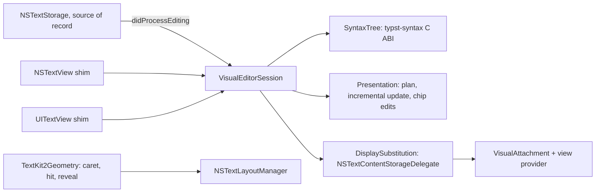
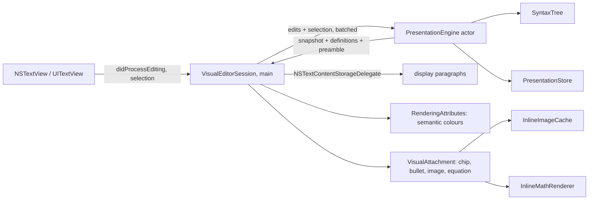

# Visual editing (LB-019)

The Mac and the iPad edit Typst source through one TextKit 2 visual layer over
a typst-syntax presentation model, both in `LeftBlankCore`: markup outside the
caret's construct is concealed, function calls with literal arguments are chips
with forms, and `#image` files and equations are drawn inline. Source stays
the document of record. [§E](#e-the-delivered-editor) describes the delivered
editor and its measurements; §A–C record the spike that chose this design
(draft PR #75, M4 Pro, macOS 27.0, Xcode 27.0, iPad Pro 11-inch (M5)
simulator); §B2 and §D describe the parser bridge and the math engine API.
Numbers come from instrumented debug builds unless stated otherwise.

## Decision

**Build one TextKit 2 visual layer and share it verbatim between `NSTextView`
and `UITextView`.** Source stays the document of record. Outside the caret's
construct, an `NSTextContentStorageDelegate` returns a display paragraph with
the **same UTF-16 length** as the source:

- concealed markers become U+200B (zero width);
- a chip, image or math box becomes U+200B ending in one U+FFFC, which
  carries an attachment. The box comes last because TextKit 2 drops the height
  of a box that only zero-width characters follow to the end of its line: an
  equation or image alone on its line overlapped the lines around it.

Because display and source locations map 1:1, TextKit 2's own selection, hit
testing, IME and editing ranges remain source ranges. `NSTextStorage` (save,
undo, copy, find, Tinymist) never sees a display character.

The presentation model comes from **typst-syntax** through a small C ABI. On the
iPad it is linked into the existing engine library; on the Mac it is a static
library linked into the app. The model is pure Swift in `LeftBlankCore`.

In the prototype, 94% of the visual-layer source compiles unchanged on both
platforms. The per-platform code is one ~45-line view shim on each side (§C).

TextKit 2 has large-document gaps that this layer works around (§B, §E):
jumps never trust `scrollRangeToVisible`, and hit tests after a jump use the
laid-out viewport. The spike's TextKit 1 implementation was measured as a
baseline only; neither editor keeps a TextKit 1 path.

This supersedes the scope line in [editor-evolution.md](editor-evolution.md)
(updated there),
"Arbitrary Typst functions and package templates are not converted into visual
widgets". The new scope:

- Calls whose arguments are all literals, to functions with a visible `#let`
  signature, may render as chips, with a form editor generated from that
  signature.
- Calls that carry content (`#f[...]`), expressions or errors stay source.
- Equations follow the engine-rendered fragment direction in
  [editor-rendering.md](editor-rendering.md).

## Targets and how the layer maps them

| Target | Mechanism | Delivered |
|---|---|---|
| Headings, strong, emphasis, raw, links, refs, labels, list markers | Conceal marker units; style the rest; reveal when the selection touches the construct | Mac and iPad |
| Function chips (`#item("LB-001", "标题", "done")` → `LB-001 标题 [已完成]`) | Replacement box with a view; parameter names from the `#let` signature; value labels from the document's own `.at(parameter)` tables | Mac and iPad, with the shared form and Repeat Previous Call |
| Inline images | `#image("…")` replacement, decoded off the main thread | Mac and iPad (SVG and PDF on the Mac only) |
| Inline math | Engine-typeset images (§D) as boxes; source while the caret is inside | Mac and iPad |

## A. Text system

### Concealment techniques, measured

Behaviour tests (`TextKit2BehaviourTests`, `TextKit1BaselineTests`) run on real
views in a real window, on macOS and in the iPad simulator. The sample mixes
CJK, emoji, a chip, a list and math.

| Technique | Hidden marker width | Backing string | Mapping and caret | Verdict |
|---|---|---|---|---|
| **TK2 same-length substitution (U+200B / U+FFFC)** | **0.0 pt** (Mac, iPad) | Unchanged | 1:1; hit tests round-trip on every visible character | **Chosen** |
| TK2 substitution, keep characters with a 0.01 pt clear font | 0.005 pt | Unchanged | 1:1 | Works, but it is today's hack moved into the display layer |
| TK2 length-changing substitution (delete markers) | n/a | Unchanged | Caret drifts by 17.3 pt (two characters); offsets at the paragraph end have no caret rect | Rejected: TextKit 2 reads display offsets as document offsets |
| TK2 custom `NSTextLayoutFragment` drawing | 8.65 pt (unchanged) | Unchanged | Unchanged | Drawing only; geometry cannot collapse. Use it for decoration, not concealment |
| TK1 null and control glyphs (`ConcealingLayoutManager`) | 0.0 pt (Mac, iPad) | Unchanged | 1:1 | Works; fallback |
| Current: 0.1 pt font on markers | about 0.05 pt | Unchanged | 1:1 | Replaced |

The same results hold for both TK2 rows on both platforms:

- **Chips.** Layout width equals the box (130 pt, both platforms). A tap in the
  middle resolves to the call's start through `NSTextSelectionNavigation` (both
  platforms) and through `UITextView.closestPosition`. `NSTextView`'s
  `characterIndexForInsertion` answers start + 1, which is inside the call. The
  selection then touches the construct and reveals it, so no snapping is needed.
  Attachment view providers are created only for an ordered-in window (0
  requests hidden, 6 visible). This matters for tests, not users. On iOS 27,
  `UITextView` hosts attachment views only for attachments in the text storage,
  not in display paragraphs: the views load but never join the hierarchy, and
  UIKit draws its placeholder icon instead. The iPad therefore draws every box
  as the attachment's image (§E).
- **Caret navigation.** With a static plan, `NSTextSelectionNavigation`
  (`destinationSelection`, the engine behind arrow keys on both platforms) moves
  from before `*粗体*` straight to the first visible unit inside it. The stops
  were [74, 75, 76, 77] from 72; it never rests on the hidden `*`.
  `NSTextView.moveRight` agrees (74). Entering any construct therefore reveals
  it, which is the Obsidian behaviour. Atomic chips that are never revealed
  would need custom navigation.
- **Instant reveal.** On a selection change, re-planning and rebuilding the
  affected paragraphs (at most 3) took 1.0 ms median on both the Mac and the
  iPad. That replaces today's 100 ms debounce. It creates no undo records.
- **Chinese IME.** The marked-text rect starts at the visible caret, next to a
  concealed chip: 247.5 vs 247.5 pt on the Mac, 242.5 vs 242.5 on the iPad.
  Plan updates are deferred while text is marked. The committed string is
  exact, and one undo restores the source.
- **Undo.** A form edit is one native replacement; one undo restores the call
  and its chip label. "Repeat previous call" produces `#item("", "", "done")`
  with two Tab placeholders.
- **Copy (Mac).** `writeSelection` copies source (`Text *粗体 bold* and`). Copy
  on the iPad was not exercised, because the simulator pasteboard can sync to
  the host. The backing storage is unchanged, so the same is expected.
- **Accessibility.** On the Mac, `accessibilityValue` is the source text;
  `UITextView` returned nil in the harness. On both platforms the range string
  is `*粗体 bold*`, so assistive technology
  reads the markup, not the display paragraph. Actual VoiceOver speech was not
  tested. Chip views are accessibility elements with the chip label.
- **TextKit 1 fallback is silent and permanent.** One `.layoutManager` access
  turns `textLayoutManager` into nil on both platforms. The Mac also posts
  `NSTextView.willSwitchToNSLayoutManagerNotification`. The migration must
  guard this (see the Mac migration path below).

### TextKit 1 on both platforms (baseline)

`ConcealingLayoutManager` uses `shouldGenerateGlyphs` (`.null`), a
control-glyph whitespace action with a custom bounding box for boxes, and
`shouldSetLineFragmentRect` for tall boxes. It is 197 lines and compiles for
both `NSTextView` and `UITextView(frame:textContainer:)`. Marker width 0, chip
width 130 = box, an IME rect at the caret, undo, copy and AX behave like TK2.

It is the lowest-risk way to share code if TextKit 2 fails the iPad gate below.
Its costs: `NSLayoutManager` temporary attributes are AppKit-only; it gives up
TextKit 2 viewport layout; and Apple's newer text features target TextKit 2.

## B. Large documents

`LargeDocumentTests` uses the real books from
[large-document-performance.md](large-document-performance.md), a 900 × 1300 pt
editor, the same six jump fractions, 60 scroll frames with bitmap drawing, and
80 mixed Latin/CJK/emoji keystrokes. TK1 here is today's explicit contiguous
stack. The harness omits Workspace, metrics and Tinymist, so absolute numbers
are lower than the app benchmark; compare rows with each other.

### macOS

| War and Peace (3.3 MB) | TK1 | TK1 + visual | TK2 | TK2 + visual |
|---|---:|---:|---:|---:|
| Jump + draw median / max (ms) | 41.5 / 682 | 85.8 / 1036 | 14.9 / 20.4 | 10.6 / 16.6 |
| Native jumps landing on target | 6/6 | 6/6 | **5/6** | **5/6** |
| Precise jumps (below) on target | n/a | n/a | 6/6, 5.9 ms | 6/6, 10.0 ms |
| Scroll + draw p95 (ms) | 0.81 | 0.69 | 2.71 | 3.01 |
| Typing median / max (ms) | 0.27 / 11.3 | 0.33 / 4.1 | 2.61 / 11.7 | 6.59 / 7.6 |
| Document height before full layout (pt) | grows lazily | grows lazily | 7,509,142 (est.) | 7,509,142 (est.) |
| Exact height (pt) | 1,155,371 | 1,155,371 | 1,155,372 | 1,155,372 |
| Full layout (ms) | 264 | 335 | 886 (104 × 8 ms) | 918 |

| SICP (1.45 MB) | TK1 | TK1 + visual | TK2 | TK2 + visual |
|---|---:|---:|---:|---:|
| Jump + draw median / max (ms) | 9.2 / 257 | 45.6 / 781 | 8.7 / 11.6 | 14.1 / 18.8 |
| Native / precise jumps on target | 6/6 | 6/6 | 6/6 / 6/6 | 6/6 / 6/6 |
| Scroll + draw p95 (ms) | 1.39 | 1.04 | 3.33 | 2.55 |
| Typing median / max (ms) | 0.32 / 6.5 | 0.53 / 2.6 | 1.80 / 2.4 | 12.1 / 14.5 |
| Estimated → exact height (pt) | n/a | n/a | 296,749 → 510,290 | 296,749 → 506,414 |

Findings:

1. **Distant jumps are much faster in TK2** (≤ 20 ms instead of up to 0.7–1 s),
   because TK1 contiguous layout must lay out everything before the target.
2. **`scrollRangeToVisible` is not trustworthy on estimated geometry.** In War
   and Peace, the jump back to 1% left the target 2,400 pt above the viewport,
   even after the run loop settled. At the same moment the view's own caret
   rect said x = 0, and `characterIndexForInsertion` at the target's real
   position returned an offset 3.2 million units away. This is the TK2 version
   of the 27 pt TK1 noncontiguous bug, and it is larger.
   `TextKit2Geometry.reveal` fixes it: lay out the target paragraph, scroll to
   its fragment, let the viewport re-anchor, repeat until stable (1–4 passes).
   It landed 6/6 with zero hit-test error on both books.
3. **Height estimates are far off.** War and Peace was overestimated 6.5×; SICP
   was underestimated 0.58×. The height also moved on every jump (1.56–2.53 M
   pt). The scroller thumb is therefore not a reliable position indicator.
   Laying out everything in 8 ms slices converges to the TK1-exact height in
   0.9 s, for about +125 MB on the Mac. **It is not durable, though:** after a
   single edit, a distant jump left only 57 of 67,962 fragments laid out, and
   later native jumps failed again. Do not rely on a background full layout;
   use precise jumps, and treat the scroller as approximate.
4. **Scrolling a laid-out viewport** costs 2.5–3.3 ms p95 per frame including
   drawing, against 0.7–1.4 ms in TK1. Scrolling up three screens and back
   showed 0 pt drift in every configuration.
5. **Visual layer cost.** Opening a session (parse + signatures) takes 88–91 ms.
   The first full plan is 10 ms (War and Peace) or 81 ms (SICP, 18,871 conceals);
   production would do it off the main thread. After that, planning is
   incremental. A selection change re-plans 0.8 ms (War and Peace) or 2.5 ms
   (SICP). A keystroke adds a 0.5–3.7 ms O(n) plan shift in the spike's flat
   arrays. Typing with the visual layer, measured as edit + parser + re-plan +
   layout, is 6.6 ms median on War and Peace and 12.1 ms on SICP. Production
   should store plan runs relative to paragraphs (as temporary attributes
   rebase today) to remove the shift.

### iPadOS (simulator)

The simulator runs natively on the Mac CPU, but it is not a device. These
numbers are indicative only.

| iPad simulator | TK1 | TK2 | TK2 + visual |
|---|---:|---:|---:|
| War and Peace typing median / max (ms) | 2.0 / 6.5 | **92 / 184** | **92 / 143** |
| SICP typing median / max (ms) | 1.6 / 6.7 | **34 / 90** | **47 / 102** |
| Scroll + draw median, War and Peace / SICP (ms) | 18 / 30 | 19 / 12 | 18 / 10 |
| Precise jumps: on target / hit-test errors / median ms, War and Peace | n/a | 6/6 / 1 / 331 | 6/6 / 1 / 362 |
| Same, SICP | n/a | 6/6 / 2 / 77 | 6/6 / 2 / 84 |
| Estimated → exact height, War and Peace (pt) | 855,735 → 1,135,460 | 13,879,019 → 1,135,455 | same |
| Memory added by full layout, War and Peace / SICP (MiB) | +50 / +36 | **+1,700 / +644** | +1,603 / +627 |

Findings:

- **TextKit 2 typing in `UITextView` scales with document size.** On War and
  Peace it was 46× slower than TK1 in the same harness. A breakdown rerun put
  57.4 ms of the 59.2 ms median inside `UITextView.replace(_:withText:)`
  itself; layout was 1.6 ms and the visual layer under 0.01 ms. TK1 `replace`
  took 1.8 ms. Today's iPad editor already uses implicit TK2, so this
  is existing behaviour, not something the visual layer introduces. It still
  must be profiled on a device before multi-megabyte books are a target there.
- **Full layout uses about 1.7 GB on iPad TK2.** A background full-layout pass
  is ruled out there.
- **Native scrolling did not land on target.** In this harness,
  `UITextView.scrollRangeToVisible` did not bring distant targets into view in
  either TK1 or TK2 (0/6), even after a run-loop turn. Setting `contentOffset`
  from TK2 fragment geometry did (6/6), but it took 0.08–1 s per jump. In 1 of
  6 jumps (War and Peace) and 2 of 6 (SICP), `closestPosition` at the laid-out
  target still disagreed with layout, by 46,840–141,757 units. The suite
  records this as a known issue on iPad. Today's iPad
  jump (`TabletWorkspace.jump`) uses `scrollRangeToVisible`, so this must be
  re-checked in the real app with a key window and a scene.

### Mitigations adopted in the plan

- All jumps go through one TK2 geometry helper: preview sync, outline,
  diagnostics, definition, search. Tests assert hit-test round trips after
  distant jumps, as the book benchmark does today.
- No full-layout pass. Outline and rail positions come from fragment frames of
  laid-out paragraphs, plus character-offset fractions for the rest. The
  scroller stays native, and we accept that its thumb is approximate. A custom
  offset-based scroller is possible later if needed.
- Gate: on iPad, if device typing in a 1.4 MB book exceeds the 100 ms p95
  typing budget, ship visual editing there on TK1 (`ConcealingLayoutManager`)
  until TextKit 2 improves. The presentation model and session do not change.

## B2. Parser: typst-syntax through a C ABI (step 1, implemented)

[`Engine/SyntaxBridge`](../Engine/SyntaxBridge) wraps typst-syntax 0.15.1 from
the same Myriad-Dreamin tag the iPad engine pins; `scripts/test-package-graphs.py`
checks that both lockfiles resolve one revision. The C declarations are in
[`LeftBlankSyntax.h`](../Sources/LeftBlankSyntaxFFI/include/LeftBlankSyntax.h).
The library exports one symbol, `lb_syntax_api`, a versioned table of entry
points:

- `parse` and `free`;
- `edit`, which wraps `Source::edit` and returns the reparsed UTF-16 range;
- `nodes`, a pre-order flat list with stable LeftBlank kind codes, UTF-16
  ranges, a parent index, depth and an error flag, optionally limited to a
  window (each node is listed with its parent);
- `utf16_length`, `kind_name` and `nodes_free`.

Offsets are UTF-16. `edit` rejects ranges that split a surrogate pair, which
typst-syntax would round silently; windows round outward. Every entry point
catches panics, and a panic during an edit leaves the tree unusable rather than
inconsistent. Text and Space leaves are not emitted, and Math is opaque. The
kind-code match is exhaustive, so a typst-syntax upgrade that adds a kind fails
to compile until it is given a new, appended code. The flattener is iterative;
a 400-level nesting test runs on a 512 KiB secondary-thread stack.

`SyntaxTree` (`LeftBlankCore`) owns one tree, mirrors each native replacement
and converts nodes to `SyntaxNode` values with a `SyntaxKind` enum. A rejected
edit invalidates the mirror, and the owner parses again.

### Build and packaging

- **Mac.** `scripts/build-syntax.sh` (run by `scripts/bootstrap.sh`, so by
  `scripts/build.sh` and `scripts/test.sh`) builds the release static library
  for `aarch64-apple-darwin` with Rust 1.92.0 and wraps it as
  `Engine/SyntaxBridge/target/LeftBlankSyntax.xcframework`. The root manifest
  consumes it as the `LeftBlankSyntaxLibrary` binary target behind the
  `LeftBlankSyntaxFFI` header module. Run the script once before a plain
  `swift build`; SwiftPM reports a missing binary artifact otherwise. This is
  the first Rust code in the app process; Tinymist and the MCP helper remain
  helpers. A static library needs no entitlement or helper signing, so
  Developer ID, notarization and the App Store build are unaffected. The
  dependency notices go into the app as `TypstSyntax-LICENSES.txt`.
- **iPad.** `Engine/TinymistBridge` depends on the crate and exports
  `leftblank_tinymist_syntax_api`, so the app still links one Rust static
  library (two would duplicate the Rust runtime: 2,166 duplicate symbols with
  `-all_load` in the spike). LeftBlankCore is a dynamic framework on iPad and
  does not link the engine; `Sources/Package.swift` builds the header module
  only, and the app passes the table to `SyntaxTree.install` at launch.
  The shared Core tests, which also run in the iPad simulator, check that the
  parser is installed.
- **CI.** Mac jobs cache `.tools/cargo-syntax` and `Engine/SyntaxBridge/target`;
  the regression job runs the crate's `cargo fmt`, `clippy` and tests. iPad
  engine cache keys include the crate's sources.

### Measurements

`bookLengthSourcesParseWithinBudget` parses both checked-in books on every
Swift test run and asserts budgets about 20 times the local results, for slow
shared runners. `scripts/benchmark-books.sh` records them in
`build/benchmarks/syntax.json`. Local results (M4 Pro, release Rust, debug Swift):

| | War and Peace (3.3 MB) | SICP (1.45 MB) |
|---|---:|---:|
| Full parse | 14.7 ms | 11.5 ms |
| Nodes emitted / converted to Swift | 17,590 in 3.3 ms | 111,859 in 7.8 ms |
| Keystroke: edit + reparsed-range nodes, median (max) | 2.0 (5.2) ms | 0.8 (2.2) ms |
| Unclosed `$` (reparses to the end) | 94 ms | 71 ms |
| Today's regex/lexer full scan (`SourcePresentation`, `-O`, spike) | 41.3 ms | 18.1 ms |

Unclosed constructs are the worst case: typing `$` or a fence in the middle of
a book reparses to the end of the document. The tree marks those nodes
erroneous, and the model never conceals erroneous constructs. Production parses
on a serial background actor and applies plans by revision, exactly as reading
analysis works today.

Size: the static library is about 24 MB on disk, mostly symbols; a stripped
binary that links it grew by about 0.6 MB in the spike (Mac and iOS).

## C. Architecture and sharing



### Presentation model (step 2, implemented)

`Presentation.plan` (`LeftBlankCore`) takes the source, syntax nodes (all, or a
window from `SyntaxTree.nodes(in:)`), the selection, the document's `#let`
definitions and `PresentationOptions` (reveal policy, chip value labels, image
switch, rendered fragments). Its output is a `DisplayPlan`, every array sorted
by location:

- conceal ranges: heading markers with their space, `*`/`_`, inline raw
  backticks and language, the `@` of a reference, `<`/`>` of a label;
- atomic replacements: a chip with its argument model, a list bullet, an image
  (`#image("literal path", …)`), or a cached engine fragment for an equation;
- style runs (heading level, strong, emphasis, code, link, reference, label,
  list markers, math, and revealed markers);
- inline image and math requests, and the revealed construct extents.

Reveal rules: with `.construct`, a construct shows its source while the
selection touches it, including at either edge; with `.paragraph` (today's
behaviour), every construct in the selection's paragraphs does. Erroneous or
incomplete constructs (`*open`, `$x`, an empty heading, `#f(1`) stay source.

A call becomes a chip only when it is `#name(…)` with literal arguments
(strings, numbers, booleans, `none`, `auto`) and a `#let name(…)` definition
appears before it; as in Typst, the latest earlier definition applies.
Positional arguments take their names from that signature. Content blocks,
expressions, spreads, field-access callees and unknown string escapes keep the
call as source.

`PresentationStore` keeps the plan for one buffer in blocks of whole
paragraphs (at least 2,048 UTF-16 units) with entries relative to the block
start; no construct or definition crosses a block boundary. An edit merges the
blocks it touches, moves later block starts, and re-plans the union of the
edited and reparsed ranges, growing the window until no construct crosses its
edge. A selection change re-plans the old and new selection. A change to the
sequence of definitions re-plans everything. This replaces the spike's O(n)
flat-array shift: on SICP (620 blocks), a full plan takes 0.17 s and a
keystroke (tree edit, plan update and caret move) 1.8 ms median, debug build.
Seeded random edits and selection moves, under both reveal policies, must
leave exactly the plan a fresh store computes.

`ChipEditing.edit` turns form values into one `TextReplacement`: it changes
argument values in place, keeps each argument's literal kind (validating
numbers and keywords with the parser), appends missing positional and named
arguments in order, and preserves spacing and comments between arguments.
`ChipEditing.repeatPrevious` copies the nearest earlier chip's call as a
`Snippet`, keeping labelled (enumerated) values and turning the rest into Tab
placeholders. The platform applies either as one native edit.

| Prototype component | Lines | Mac | iPad |
|---|---:|---|---|
| `SyntaxTree` + `Presentation` (pure model) | 962 | shared | shared |
| `DisplaySubstitution`, `VisualAttachment`, `TextKit2Geometry`, `VisualEditorSession` | 611 | shared verbatim | shared verbatim |
| Platform shim (`BoxView`, image renderer, type aliases) | about 45 | AppKit half | UIKit half |
| TK1 baseline (`ConcealingLayoutManager`) | 197 | shared | shared |
| Rust bridge | 377 | linked | re-exported by the engine |

Production estimate:

- **Shared.** About 1,800 lines move to `LeftBlankCore`: the model, the syntax
  wrapper and plan storage. About 800 lines of shared TK2 adapter go to a new
  `LeftBlankEditorKit` target, built by both manifests.
- **Per platform.** About 250 lines on each side: view integration, the
  form-editor popover host and selection forwarding.
- **Mac migration.** About 400 lines changed.
- **Ratio.** Roughly 85% shared, 15% platform-specific. The form UI can be one
  SwiftUI view.

## D. Inline math engine API (step 8a, implemented)

Equations render with the document's own engine generation, Tinymist 0.15.8 /
Typst 0.15.1, in a **dedicated session** separate from the manuscript's. On the
Mac it is its own helper process; on the iPad it is a second embedded session,
as hover examples use. Nothing goes through the manuscript's LSP session, so
its preview, diagnostics and main file are untouched. The editor calls one
protocol from `LeftBlankCore`:

```swift
public protocol InlineMathRenderer: Sendable {
    /// Results in request order. Batches and caches internally.
    func render(_ requests: [MathRenderRequest]) async -> [MathRenderResult]
    /// Fresh or stale result available now; safe on the main thread during layout.
    func cached(_ request: MathRenderRequest) -> MathRenderResult?
}

public struct MathRenderRequest: Hashable, Sendable {
    public var source: String      // the equation node's text, with its `$` delimiters
    public var isBlock: Bool       // `$ x $`
    public var style: MathRenderStyle
    public init(source: String, isBlock: Bool, style: MathRenderStyle)
    public init?(_ request: InlineRequest, style: MathRenderStyle)  // from a DisplayPlan
}

public struct MathRenderStyle: Hashable, Sendable {
    public var fontSize: Double    // editor font size; the document's body size maps to it
    public var color: MathColor    // editor theme text colour (sRGB bytes; MathColor(CGColor))
    public var preamble: String    // MathPreamble.extract(source:nodes:)
    public var scale: Double       // pixels per point (backing scale)
    public var root: URL?          // Typst project root; defaults to `directory`
    public var directory: URL?     // the source's folder, for the preamble's relative imports
    public init(fontSize: Double, color: MathColor, preamble: String = "", scale: Double = 2,
                root: URL? = nil, directory: URL? = nil)
}

public struct MathRenderResult: Sendable {
    public let request: MathRenderRequest
    public let image: MathImage?        // with errors or isStale: an earlier rendering of this source
    public let diagnostics: [MathDiagnostic]  // errors fail; warnings (rules dropped) do not
    public let isStale: Bool            // not this request's rendering: show it marked
    public var failed: Bool
}

public struct MathImage: @unchecked Sendable {
    public let image: CGImage           // transparent, ink in `color`, already decoded
    public let size: CGSize             // layout box in points: draw the image into it
    public let baseline: CGFloat        // top edge to baseline, in points
    public var descent: CGFloat         // attachment bounds: (0, -descent, width, height)
    public var scale: CGFloat           // image pixels per point
    public var fragment: RenderedFragment  // for PresentationOptions.fragments
}

public struct MathDiagnostic: Hashable, Sendable {
    public let severity: Severity       // .error or .warning
    public let message: String          // Typst's message, with hints on later lines
    public let range: NSRange?          // UTF-16 offset in the request's source, or nil
}
```

Construct it with `TinymistMathTypesetter.renderer(stateDirectory:)` on the Mac
and `TabletWorkspace.makeInlineMathRenderer()` on the iPad, one per window. Both
return an `EngineMathRenderer` actor; `renderer.cache` (`MathRenderCache`) can
be cleared with `removeAll()` when an imported file changes on disk. A typical
editor loop: take the plan's `InlineRequest.math` requests for the visible
blocks, map them to `MathRenderRequest`, draw `cached(_:)` immediately (stale
results marked), call `render(_:)` off the main actor, then put each result's
`image.fragment` into `PresentationOptions.fragments` keyed by `source`.

### How it renders

For each batch of up to 200 equations with one style, `EngineMathRenderer`
writes one virtual Typst file in the document's folder. It is opened in the
math session with `didOpen`/`didChange` and never written to disk. The file
contains:

1. the **document's rules**: top-level `#set`, `#show selector: …`, `#let` and
   `#import` statements (`MathPreamble`). Whole-document `#show: template` rules
   and content are left out, because a template's pages and title would shape
   every equation's page;
2. overrides, which win because they come later: `page(width: auto,
   height: auto, margin: 0pt, fill: none)` without furniture, no first-line
   indent, no equation numbers, and the editor's colour for text and for
   `math.equation`;
3. each equation in `box(eq)` on its own page, with a probe in the same line.
   The probe records `measure(box).width/height`, the descent, the body text
   size and its page into `#metadata(…)<lb-math-probe>`.

Typst's `measure` returns no baseline, so the probe measures the box after a
zero-width strut taller than the box. That line's height is the strut plus the
box's descent, which gives the baseline. Inline equations get a leading of 0
inside their box, because Typst lets them overhang into half the leading: with
the default leading, an inline fraction's page clipped its denominator. Display
equations keep the document's leading between their lines. A box gives a
display equation its first line's baseline.

`tinymist.exportQuery` returns the probes. `tinymist.exportPng` then renders
the valid pages at `72 × scale × fontSize / bodySize` ppi, so the document's
body size becomes the editor's size while relative sizes in its rules
(`1.2em`) still apply. PNGs are decoded to `CGImage` on the renderer actor.
The main thread never decodes; it only relays the session's JSON messages.

**Failures stay per equation.** A compile error locates the failing equation
from Typst's `path:line:column` report. Only that equation fails, with the
message and a UTF-16 location in its source; the rest of the batch is compiled
again. If the rules alone fail to compile (an edit in progress, or a missing
import), the batch renders without them and every result carries a warning.
An error with no location splits the batch. Equations whose image would exceed
4,096 px fail with a diagnostic and are never rasterized.

**Cache and staleness.** Results are cached by request (source and style). The
key contains no revision, so typing elsewhere, moving an equation or repeating
it costs nothing. The cache holds at most 64 MiB of decoded bitmaps and 4,096
entries, least recently used first. Engine failures are cached too, so an
invalid equation does not recompile on every keystroke. An unavailable engine
is never cached. When the exact request has no image, `cached(_:)` and
failures return the last image of the same source in another style (another
size, colour or rules) with `isStale = true`. Concurrent requests for the same
equation share one compile. Batches are compiled one at a time.

**Session lifetime.** The session starts on the first request. A different project root restarts it. It
stops after 60 idle seconds (30 on the iPad) and restarts on demand.

### Measurements

`InlineMathEngineTests` (Mac, `LEFTBLANK_INTEGRATION=1`), 2026-10-07, M4 Pro,
debug Swift, source-built release Tinymist. Unique equations, engine already
running, 16 pt at 2×:

| Batch | Time | Note |
|---|---:|---|
| 1 equation | 1–3 ms | |
| 20 equations | 9–19 ms | |
| 200 equations | 85–151 ms | low end on an idle machine; high end while an iPad build ran |
| SICP, all 1,356 equations (493 unique), book rules imported | 472–651 ms | includes engine start; 9–11 ms when cached; none failed |

Engine start before the first result took 67–110 ms. Memory: 222 cached
images took 3.8 MiB of decoded bitmaps, and SICP's 493 took 15–17 MiB. The
math helper process was 67–95 MiB resident. The test budgets are about 20×
these numbers, for shared CI runners. The iPad simulator test (embedded engine,
same fixtures) passed on the iPad Air 11-inch (M4) simulator, iOS 27.0, and
on a physical iPad Air (5th generation, M1), iPadOS 26.5. On the device, the
first batch of four equations, including the embedded session's start, took
0.42 s for the whole test.

Correctness checks against the real engine. They run on the Mac and, through
the embedded engine, in the iPad simulator:

- an `x` ends on the baseline (within 0.5 pt);
- a `y` descends to the bottom of its box, and both share a baseline;
- a fraction bar lies on the maths axis, 0.25 em above the baseline (±0.5 pt);
- a display equation's first band of ink ends at the reported baseline;
- each image is the box size × scale (±1 px);
- the ink is the light or dark editor colour, even under a document
  `show math.equation: set text(fill: red)`;
- 8 pt and 20 pt documents both render at the editor's 16 pt;
- relative imports resolve beside the document;
- broken rules give a warning;
- invalid maths gives the engine's message at the correct UTF-16 offset,
  including on a later line after CJK text, while the rest of the batch renders.

### Limits

- **Rules inside templates are not seen.** Rules a template applies inside
  `#show: template` are left out with it. SICP's `book` sets Libertinus Serif
  at 10 pt that way, so its equations use Typst's default text font and size
  (scaled to the editor's), with the template's top-level imports and `#let`s.
- **Rules apply to the whole file.** A rule anywhere at top level styles every
  equation, even one before it.
- **Disk changes are not noticed.** The cache knows nothing of files the rules
  import; call `removeAll()` after they change.
- **Runaway equations.** An equation that computes for 30 s times out the
  session request; the Mac helper is killed and restarted. The iPad's embedded
  worker cannot be killed, as for hover examples.
- **Not yet profiled on an iPad device.** The device test checks correctness,
  not memory. The second embedded session costs memory alongside the
  manuscript's.

## E. The delivered editor

Both editors run on TextKit 2 with one visual layer from `LeftBlankCore`
(`Sources/LeftBlankCore/VisualEditing`). TextKit 1, the 0.1 pt marker font,
the regex/lexer `SourcePresentation` and the hand-written `ObjectScanner` are
gone; code-block highlighting, literal-object editing and preview call sites
read `SyntaxTree` too. There is no setting and no fallback.



| Part | What it does |
|---|---|
| `PresentationEngine` | Actor owning the tree, the plan store, the source copy, chip value labels and the math preamble. Receives batches of native edits with the current selection; one request is in flight at a time and later edits queue. |
| `PresentationSnapshot` | The plan as a value. The main thread rebases it across each native edit in O(blocks): later entries move, entries the edit touches are dropped. A reply is rebased by edits made meanwhile, and only entries that changed are invalidated. |
| `VisualEditorSession` | `NSTextContentStorageDelegate`: builds each paragraph's display text (same UTF-16 length; U+200B conceals, U+200B…U+FFFC boxes; heading sizes, strong, emphasis, code, links, references, labels, list markers, revealed markers). Invalidates changed paragraphs with attribute-only edits (no undo record, no selection change); defers while text is marked. |
| `RenderingAttributes` | Tinymist semantic colours as rendering attributes, so a reply never re-lays out text. A mirror answers reads; changed spans are pushed, and many changes become one ordered rebuild (single removals cost O(runs) in TextKit 2: 3 s for 100,000 in War and Peace). |
| `TextKit2Geometry` | Caret, segments, hit tests and reveal without `layoutManager`. Mac jumps lay out the target and the text above it, and repeat until it stops moving; iPad jumps anchor the viewport on the target (`relocateViewport`). Hit tests that matter after a jump use the laid-out viewport fragments (`viewportInsertionOffset`). |
| `ChipForm` | One SwiftUI form for both platforms, generated from the `#let` signature. Labelled values become pickers. Apply writes one replacement (`ChipEditing.edit`), so one undo restores the call. |
| `InlineImageCache` | Decodes `#image` files off the main thread (ImageIO thumbnails, at most 960 px; SVG and PDF through `NSImage` on the Mac), caches by path and modification date (64 entries), and shows at most 480 × 360 pt. A missing or undecodable file shows its name. |
| `VisualAttachment` | The box. On the Mac it is a view (`VisualBoxView`); chips take clicks. On the iPad UIKit draws it as the attachment's image, resolving theme colours in the view's traits, and `TabletTextView` hit-tests chip taps (`chip(at:)`) to open the form. |
| Math | `EngineMathRenderer` (§D): the Mac's own Tinymist helper, the iPad's second embedded session. Visible equations are requested in one batch per layout pass; cached and stale images show at once; the caret entering an equation shows its source. Images carry the theme's colour, so a change to dark or light mode typesets them again (`appearanceDidChange`); each keeps its previous image until then. |

**Reveal.** A construct shows its source while the selection touches it; the
others in the paragraph stay concealed (Obsidian's live preview). Typing never
waits: the edited paragraph shows the rebased plan until the engine's reply.

**Chips.** A call becomes a chip when its arguments are literals and a `#let`
signature precedes it. Value labels come from the document itself: a parameter
used as `(key: value, …).at(parameter)` takes the keys as values and the first
string of each value as its label, and a parameter forwarded to such a function
inherits them. For the tracker's `#let status(s) = {(todo: ("待办", gray), …).at(s)}`
and `#let item(id, title, s, …) = [… #status(s)]`, `#item("LB-019", "…", "doing")`
reads `LB-019 … [进行中]`. Clicking or tapping a chip opens its form; hovering
it shows the function's help. **Repeat Previous Call** (⌃⌘R on both platforms,
and in the Mac command palette) copies the nearest earlier chip's call, keeps
labelled values and turns the rest into Tab placeholders.

**Guards.** One `layoutManager` access switches a view to TextKit 1 for good
and disables the layer. SwiftLint rejects the identifier in sources and tests;
the Mac view observes `willSwitchToNSLayoutManagerNotification`, logs
`editor.textKit1Fallback` and records it, and every Mac editor test fails if
its view is no longer on TextKit 2.

### Large documents, measured

Mac: `scripts/benchmark-books.sh` (debug build, M4 Pro). Before is today's
[TextKit 1 report](large-document-performance.md).

| | W&P TK1 | W&P TK2 + visual | SICP TK1 | SICP TK2 + visual |
|---|---:|---:|---:|---:|
| Open (s) | 4.09 | 0.56 | 3.32 | 0.52 |
| Typing median / p95 / max (ms) | 9.29 / – / 52.2 | 5.5 / 5.8 / 6.9 | 6.70 / – / 10.9 | 3.8 / 4.2 / 4.6 |
| Navigate + draw median / max (ms) | 4.20 / – | 7.1 / 10.1 | 6.07 / – | 14.8 / 25.0 |
| Scroll + draw p95 (ms) | 5.04 | 2.6 | 3.89 | 3.0 |
| Paragraphs TextKit built in the run | – | 1,299 of 67,963 | – | 995 of 20,512 |

CI runs the same benchmark on GitHub's macOS 15 runners (Xcode 26.3), which
are slower and stricter about TextKit 2 (below). There, against the TextKit 1
editor's last run on the same runners: War and Peace types at 11.8 / 38.4 /
103.5 ms median / p95 / max (TextKit 1: 6.0 / 39.3 max), at most 17 ms of
main-thread CPU per key, with the slowest jump at 54 ms (11); SICP types at
10.6 / 26.2 / 67.1 ms (3.2 / 12.4 max) with the slowest jump at 181 ms (41).
Both books stay within the gates (typing p95 100 ms, any key 250 ms, any
jump 200 ms) and build about 1,300 and 1,000 paragraphs.
| Jumps on target, max hit error | 6/6, ≤ 1 | 6/6, 0 | 6/6, ≤ 1 | 6/6, 0 |
| Line drift after scrolling away and back (pt) | 0 | 0 | 0 | 0 |

iPad Air (5th generation, M1, iPadOS 26.5), production `TabletEditor`,
`TabletLargeDocumentTests` (books copied to the app's `Documents/Books`):

| | SICP before (main) | SICP now | W&P before (main) | W&P now |
|---|---:|---:|---:|---:|
| Typing median / p95 (ms) | 870 / 945 | 33–48 / 34–49 | did not finish 80 keys in 15 min | 96–101 / 97–151 |
| Jumps on target (viewport check), max tap error | – | 6/6, 0 | – | 6/6, 0 |
| Jump median / max (ms) | 143 / 276 | 42–83 / 145–239 | – | 152–154 / 390–401 |
| Memory after open / after typing (MiB) | 320 / 322 | 302–334 / 268–287 | – | 757–850 / 815–835 |

What made iPad typing slow was not TextKit 2 itself: every keystroke rebuilt
the line index and word count of the whole text, compared the whole text as
Swift strings (Unicode-normalizing) up to four times, JSON-encoded the text for
recovery, sent the full text to Tinymist, and resolved the source path on disk.
These are now incremental, compared literally or by version, coalesced (160 ms
for Tinymist, 400 ms for recovery, as on the Mac) and cached. The Mac had one
of these too: its toolbar compared the whole text with the saved text as
Swift strings on every keystroke (20 ms per key in War and Peace). What remains in
War and Peace is UIKit's own TextKit 2 viewport pass, which estimates the size
of every paragraph between the nearer end of the document and the viewport: a
bare `UITextView` takes 60–92 ms per key in the middle of War and Peace, 5 ms
near either end, and a third of that with fewer, longer paragraphs. Layout
traps found and fixed on the way:

- Revealing the restored caret before the first layout pass makes TextKit 2
  lay out every paragraph above it; each later keystroke then pays for all of
  them (40 ms in War and Peace on the Mac). The caret is revealed after it.
- Installing a book's first plan after layout began invalidated every
  paragraph and threw TextKit's geometry away; scrolling then drifted by
  374,000 pt. The first plan is synchronous (about 0.1 s for a book).
- On iOS, after a distant jump, a fragment laid out on its own and the
  viewport's fragments can disagree by 100,000 characters at the same height.
  Taps, hit tests and jump checks use the viewport's fragments.
- Every edit walks each text element TextKit has built after it, so one
  step that builds a whole book slows every later keystroke (45 ms in War
  and Peace on CI). The book benchmark counts the paragraphs TextKit builds
  and fails above 5,000; on CI's macOS 15 it found two such steps.
- Re-wrapping (a window resize, a pane opening, or on CI the window shrinking
  to the runner's screen) discards TextKit 2's layout, and NSTextView then
  finds a far-down viewport by laying out every paragraph above it, on macOS
  27 too: all 80,000 paragraphs of a long test document, all 41,302 of War
  and Peace on CI. The Mac view keeps the top line in place by location
  across width changes: it lays out the text around that line, and again
  after the next pass, whose first sizing clamps the scroll.
- Scrolling a jump target a third of a screen down, onto text not laid out,
  made TextKit lay out forward from the nearest laid-out fragment above:
  17,000 paragraphs and 1.3 s for one SICP jump on macOS 15. Jumps lay out
  a screen of text around the target first. The view also never scrolls past
  the end of its text.
- On iPadOS, re-wrapping (rotation, Split View) does not lay the book out, but
  UIKit's first sizing of the re-wrapped text clamped the scroll and threw
  the reader back to the start of the book. The iPad view puts its top line
  back through the viewport, as jumps do.

## Follow-ups

- **iPad War and Peace typing.** About 100 ms per key, at the budget's edge,
  set by UIKit's viewport pass. A content manager that groups short lines into
  larger elements would cut it roughly threefold (measured with joined
  paragraphs); SICP-sized books already have headroom.
- **Math in templates.** Equations ignore rules inside `#show: template` (§D).
- **Accessibility** reads markup (risk 3).

## Risks

1. **TextKit 2 estimated geometry (handled).** Native `scrollRangeToVisible`
   missed 1 of 6 War and Peace jumps on the Mac and nearly every distant jump
   on the iPad; estimated heights are off by up to 6.5×. Jumps use precise
   reveal on the Mac and viewport relocation on the iPad; both books land 6/6
   with zero hit error (§E). The scroller thumb remains approximate.
2. **iPad TextKit 2 large documents (measured on a device).** SICP types in
   33–48 ms; War and Peace in about 100 ms, set by UIKit's viewport pass (§E).
   No full-layout pass is used (it cost 1.7 GB in the simulator).
3. **Accessibility reads markup.** The AX API exposes the source, including
   `*` and `#item(...)`. A custom accessibility text for concealed runs needs
   its own design and VoiceOver testing.
4. **Math (addressed by §D).** Tinymist exposes no API that returns an
   equation's fragment with bounds and baseline, but none is needed: a
   synthetic document measures each equation in Typst and exports it as a
   page, through the existing `exportQuery` and `exportPng` commands. No
   Tinymist patch was added. Remaining limits are listed in §D.
5. **Rendering attributes (handled).** On macOS 27 and iPadOS 26 TextKit
   moves them with edits, as temporary attributes were; the session's mirror
   follows the same rule, and identical syntax replies write nothing.
6. **Atomic chips.** If the product wants chips that never reveal source,
   arrow keys and the `NSTextView` hit test land inside the call. That would
   need custom `NSTextSelectionDataSource` navigation, which the spike did not
   attempt.
7. **Plan storage cost (handled).** `PresentationStore` keeps entries
   relative to paragraph blocks; the main thread's snapshot rebases in
   O(blocks), and parsing never runs on the main thread after open.
8. **Attachment views exist only in ordered-in windows.** Tests that inspect
   chip views need a visible (off-screen) window.

## Reproduce the spike

The spike branch (draft PR #75) keeps the prototype and its scripts:
`scripts/visual-editing-spike.sh` runs the Rust tests and parser benchmark on
both books, compiles the regex scan the editor used then with `-O`, and runs
the prototype's Swift tests on macOS and in the iPad simulator. Its raw reports
are `docs/benchmarks/visual-editing-*.json` on that branch.

The delivered editor's numbers come from `scripts/benchmark-books.sh` (Mac)
and, on a device, from `TabletLargeDocumentTests`: copy books into the app's
container (`xcrun devicectl device copy to --domain-type appDataContainer
--domain-identifier app.leftblank.writer --source Examples/Books/SICP/main.typ
--destination Documents/Books/sicp.typ`), then run that suite with
`xcodebuild test-without-building … -only-testing:LeftBlankTabletTests/TabletLargeDocumentTests`;
`TEST_RUNNER_LEFTBLANK_IPAD_BOOK=sicp` selects one book. Reports land in the
app's `Documents/Benchmarks`.
