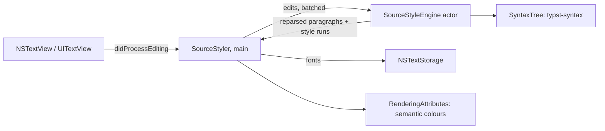

# Visual editing (LB-019): removed

From 2026-10-07 to 2026-10-09 the Mac and iPad editors had a visual layer over
TextKit 2 (PRs #76, #77, #82, #85 and #88): markup away from the caret was
concealed, function calls with literal arguments were chips with forms (and
Repeat Previous Call, ⌃⌘R, copied the previous chip's call), inline equations
were typeset by a separate engine session, and `#image` files and list bullets
were drawn as boxes. It was removed on 2026-10-09 because the result was not
good enough:

- It was inconsistent: some constructs rendered and others did not.
- AppKit's and UIKit's white document placeholder icon kept appearing over
  boxes. On the Mac it covered equations such as `φ = (1+√5)/2 ≈ 1.618`; on
  iOS 27 every box was a placeholder until #88.
- The styling was not pretty.

A reliably good version was not in reach soon, so the editor went back to the
simplest thing that works: styles that are plain attributes on the source
text. There are no hidden characters, no attachments and no display text that
differs from the source, on either platform.

## The editor now

Both editors are TextKit 2 views (`NSTextView`, `UITextView`) styled by one
`SourceStyler` from `LeftBlankCore`, so the Mac and the iPad look the same:

- headings are larger and semibold by level (+6, +4, then +2 pt), in the system
  font;
- `*strong*` is semibold, `_emphasis_` italic, and raw text monospaced, also
  inside a heading;
- Tinymist's semantic tokens colour the syntax;
- every marker stays visible, coloured by its token.

Calls, lists, equations and images are plain, coloured source. On the Mac,
**Style headings and emphasis in the editor** (Settings) turns the fonts off.

| Part | What it does |
|---|---|
| `SourceStyling` | Heading, strong, emphasis and raw runs from `SyntaxTree` nodes; erroneous constructs stay plain. |
| `SourceStyleEngine` | Actor owning a copy of the source and its `SyntaxTree`. Each batch of native edits is reparsed incrementally; the reply carries the styles of the paragraphs typst-syntax reparsed. |
| `SourceStyler` | Sets fonts on the text storage. Opening a file or changing the font styles the whole text synchronously, before the first layout. After an edit, the text keeps the fonts the storage moved with it until the reply, which is rebased across later edits and written only where a run's style differs (a `LeftBlankSourceStyle` attribute records it, so fallback fonts for CJK and emoji are left alone). Attribute edits create no undo record and keep the selection; they wait while text is marked, and keep the top line in place when text above the viewport changes height. It also counts the paragraphs TextKit builds for the book benchmark. |
| `RenderingAttributes` | Tinymist semantic colours as rendering attributes, so a reply never re-lays out text. A mirror answers reads; changed spans are pushed, and many changes become one ordered rebuild (single removals cost O(runs) in TextKit 2: 3 s for 100,000 in War and Peace). |
| `TextKit2Geometry` | Caret, segments, hit tests and reveal without `layoutManager`. Mac jumps lay out the target and the text above it, and repeat until it stops moving; iPad jumps anchor the viewport on the target (`revealByRelocating`). Hit tests that matter after a jump use the laid-out viewport fragments (`viewportInsertionOffset`). |

Code-block highlighting, literal-object editing, preview call sites, hover
help and completions read the source and `SyntaxTree`; none of them depended
on the visual layer.

**Guards.** One `layoutManager` access switches a view to TextKit 1 for good.
SwiftLint rejects the identifier in sources and tests; the Mac view observes
`willSwitchToNSLayoutManagerNotification`, logs `editor.textKit1Fallback`, and
every Mac editor test fails if its view is no longer on TextKit 2.

**Tests.** `SourceStylingTests` runs on a real text view on the Mac and in the
iPad test plan: heading fonts by level, strong, emphasis and raw fonts, laid-out
text equal to the source with no attachments, incremental styles equal to a
fresh styling after seeded edits, no selection change or undo step, and
composition. `SourceStylingFlowTests` and `TabletStylingTests` check the real
Mac and iPad editors.

## Why TextKit 2 stays

The spike on draft PR #75 measured both text systems on the two books (M4 Pro,
macOS 27.0, iPad Pro 11-inch (M5) simulator):

- Distant jumps are much faster in TextKit 2 (at most 20 ms instead of up to
  0.7–1 s on the Mac), because TextKit 1 contiguous layout must lay out
  everything before the target.
- `scrollRangeToVisible` cannot be trusted on TextKit 2's estimated geometry
  (it missed 1 of 6 War and Peace jumps on the Mac and nearly every distant
  jump on the iPad), and estimated heights are off by up to 6.5×. Every jump
  uses `TextKit2Geometry` instead; the scroller thumb is approximate.
- A background full layout is not durable (one edit discards it) and costs
  about 1.7 GB on the iPad, so the editor never does one.

## Parser: typst-syntax through a C ABI

[`Engine/SyntaxBridge`](../Engine/SyntaxBridge) wraps typst-syntax 0.15.1 from
the same Myriad-Dreamin tag the iPad engine pins; `scripts/test-package-graphs.py`
checks that both lockfiles resolve one revision. The C declarations are in
[`LeftBlankSyntax.h`](../Sources/LeftBlankSyntaxFFI/include/LeftBlankSyntax.h).
The library exports one symbol, `lb_syntax_api`, a versioned table of entry
points:

- `parse` and `free`;
- `edit`, which wraps `Source::edit` and returns the reparsed UTF-16 range;
- `nodes`, a pre-order flat list with stable LeftBlank kind codes, UTF-16
  ranges, a parent index, depth and an error flag, optionally limited to a
  window (each node is listed with its parent);
- `utf16_length`, `kind_name` and `nodes_free`.

Offsets are UTF-16. `edit` rejects ranges that split a surrogate pair, which
typst-syntax would round silently; windows round outward. Every entry point
catches panics, and a panic during an edit leaves the tree unusable rather than
inconsistent. Text and Space leaves are not emitted, and Math is opaque. The
kind-code match is exhaustive, so a typst-syntax upgrade that adds a kind fails
to compile until it is given a new, appended code. The flattener is iterative;
a 400-level nesting test runs on a 512 KiB secondary-thread stack.

`SyntaxTree` (`LeftBlankCore`) owns one tree, mirrors each native replacement
and converts nodes to `SyntaxNode` values with a `SyntaxKind` enum. A rejected
edit invalidates the mirror, and the owner parses again.

### Build and packaging

- **Mac.** `scripts/build-syntax.sh` (run by `scripts/bootstrap.sh`, so by
  `scripts/build.sh` and `scripts/test.sh`) builds the release static library
  for `aarch64-apple-darwin` with Rust 1.92.0 and wraps it as
  `Engine/SyntaxBridge/target/LeftBlankSyntax.xcframework`. The root manifest
  consumes it as the `LeftBlankSyntaxLibrary` binary target behind the
  `LeftBlankSyntaxFFI` header module. Run the script once before a plain
  `swift build`; SwiftPM reports a missing binary artifact otherwise. This is
  the first Rust code in the app process; Tinymist and the MCP helper remain
  helpers. A static library needs no entitlement or helper signing, so
  Developer ID, notarization and the App Store build are unaffected. The
  dependency notices go into the app as `TypstSyntax-LICENSES.txt`.
- **iPad.** `Engine/TinymistBridge` depends on the crate and exports
  `leftblank_tinymist_syntax_api`, so the app still links one Rust static
  library (two would duplicate the Rust runtime: 2,166 duplicate symbols with
  `-all_load` in the spike). LeftBlankCore is a dynamic framework on iPad and
  does not link the engine; `Sources/Package.swift` builds the header module
  only, and the app passes the table to `SyntaxTree.install` at launch.
  The shared Core tests, which also run in the iPad simulator, check that the
  parser is installed.
- **CI.** Mac jobs cache `.tools/cargo-syntax` and `Engine/SyntaxBridge/target`;
  the regression job runs the crate's `cargo fmt`, `clippy` and tests. iPad
  engine cache keys include the crate's sources.

### Measurements

`bookLengthSourcesParseWithinBudget` parses both checked-in books on every
Swift test run and asserts budgets about 20 times the local results, for slow
shared runners. `scripts/benchmark-books.sh` records them in
`build/benchmarks/syntax.json`. Local results (M4 Pro, release Rust, debug Swift):

| | War and Peace (3.3 MB) | SICP (1.45 MB) |
|---|---:|---:|
| Full parse | 14.7 ms | 11.5 ms |
| Nodes emitted / converted to Swift | 17,590 in 3.3 ms | 111,859 in 7.8 ms |
| Keystroke: edit + reparsed-range nodes, median (max) | 2.0 (5.2) ms | 0.8 (2.2) ms |
| Unclosed `$` (reparses to the end) | 94 ms | 71 ms |
| The regex/lexer full scan it replaced (`SourcePresentation`, `-O`) | 41.3 ms | 18.1 ms |

Unclosed constructs are the worst case: typing `$` or a fence in the middle of
a book reparses to the end of the document. The tree marks those nodes
erroneous, and erroneous constructs stay plain. The editor parses on a serial
background actor (`SourceStyleEngine`) and never waits for it.

Size: the static library is about 24 MB on disk, mostly symbols; a stripped
binary that links it grew by about 0.6 MB in the spike (Mac and iOS).

## Large documents, measured

These numbers were measured on 2026-10-08, with the visual layer; the layout
traps and fixes below hold for the TextKit 2 editor as it is now. Mac: `scripts/benchmark-books.sh`
(debug build, M4 Pro), against the
[TextKit 1 report](large-document-performance.md).

| | W&P TK1 | W&P TK2 + visual | SICP TK1 | SICP TK2 + visual |
|---|---:|---:|---:|---:|
| Open (s) | 4.09 | 0.56 | 3.32 | 0.52 |
| Typing median / p95 / max (ms) | 9.29 / – / 52.2 | 5.5 / 5.8 / 6.9 | 6.70 / – / 10.9 | 3.8 / 4.2 / 4.6 |
| Navigate + draw median / max (ms) | 4.20 / – | 7.1 / 10.1 | 6.07 / – | 14.8 / 25.0 |
| Scroll + draw p95 (ms) | 5.04 | 2.6 | 3.89 | 3.0 |
| Paragraphs TextKit built in the run | – | 1,299 of 67,963 | – | 995 of 20,512 |

CI runs the same benchmark on GitHub's macOS 15 runners (Xcode 26.3), which
are slower and stricter about TextKit 2 (below). There, against the TextKit 1
editor's last run on the same runners: War and Peace types at 11.8 / 38.4 /
103.5 ms median / p95 / max (TextKit 1: 6.0 / 39.3 max), at most 17 ms of
main-thread CPU per key, with the slowest jump at 54 ms (11); SICP types at
10.6 / 26.2 / 67.1 ms (3.2 / 12.4 max) with the slowest jump at 181 ms (41).
Both books stay within the gates (typing p95 100 ms, any key 250 ms, any
jump 200 ms) and build about 1,300 and 1,000 paragraphs.
| Jumps on target, max hit error | 6/6, ≤ 1 | 6/6, 0 | 6/6, ≤ 1 | 6/6, 0 |
| Line drift after scrolling away and back (pt) | 0 | 0 | 0 | 0 |

iPad Air (5th generation, M1, iPadOS 26.5), production `TabletEditor`,
`TabletLargeDocumentTests` (books copied to the app's `Documents/Books`):

| | SICP before (main) | SICP now | W&P before (main) | W&P now |
|---|---:|---:|---:|---:|
| Typing median / p95 (ms) | 870 / 945 | 33–48 / 34–49 | did not finish 80 keys in 15 min | 96–101 / 97–151 |
| Jumps on target (viewport check), max tap error | – | 6/6, 0 | – | 6/6, 0 |
| Jump median / max (ms) | 143 / 276 | 42–83 / 145–239 | – | 152–154 / 390–401 |
| Memory after open / after typing (MiB) | 320 / 322 | 302–334 / 268–287 | – | 757–850 / 815–835 |

What made iPad typing slow was not TextKit 2 itself: every keystroke rebuilt
the line index and word count of the whole text, compared the whole text as
Swift strings (Unicode-normalizing) up to four times, JSON-encoded the text for
recovery, sent the full text to Tinymist, and resolved the source path on disk.
These are now incremental, compared literally or by version, coalesced (160 ms
for Tinymist, 400 ms for recovery, as on the Mac) and cached. The Mac had one
of these too: its toolbar compared the whole text with the saved text as
Swift strings on every keystroke (20 ms per key in War and Peace). What remains in
War and Peace is UIKit's own TextKit 2 viewport pass, which estimates the size
of every paragraph between the nearer end of the document and the viewport: a
bare `UITextView` takes 60–92 ms per key in the middle of War and Peace, 5 ms
near either end, and a third of that with fewer, longer paragraphs. Layout
traps found and fixed on the way:

- Revealing the restored caret before the first layout pass makes TextKit 2
  lay out every paragraph above it; each later keystroke then pays for all of
  them (40 ms in War and Peace on the Mac). The caret is revealed after it.
- Installing a book's first styles after layout began invalidated every
  paragraph and threw TextKit's geometry away; scrolling then drifted by
  374,000 pt. The first styles are synchronous (about 0.1 s for a book).
- On iOS, after a distant jump, a fragment laid out on its own and the
  viewport's fragments can disagree by 100,000 characters at the same height.
  Taps, hit tests and jump checks use the viewport's fragments.
- Every edit walks each text element TextKit has built after it, so one
  step that builds a whole book slows every later keystroke (45 ms in War
  and Peace on CI). The book benchmark counts the paragraphs TextKit builds
  and fails above 5,000; on CI's macOS 15 it found two such steps.
- Re-wrapping (a window resize, a pane opening, or on CI the window shrinking
  to the runner's screen) discards TextKit 2's layout, and NSTextView then
  finds a far-down viewport by laying out every paragraph above it, on macOS
  27 too: all 80,000 paragraphs of a long test document, all 41,302 of War
  and Peace on CI. The Mac view keeps the top line in place by location
  across width changes: it lays out the text around that line, and again
  after the next pass, whose first sizing clamps the scroll.
- Scrolling a jump target a third of a screen down, onto text not laid out,
  made TextKit lay out forward from the nearest laid-out fragment above:
  17,000 paragraphs and 1.3 s for one SICP jump on macOS 15. Jumps lay out
  a screen of text around the target first. The view also never scrolls past
  the end of its text.
- On iPadOS, re-wrapping (rotation, Split View) does not lay the book out, but
  UIKit's first sizing of the re-wrapped text clamped the scroll and threw
  the reader back to the start of the book. The iPad view puts its top line
  back through the viewport, as jumps do.

## Follow-ups

- **iPad War and Peace typing.** About 100 ms per key, at the budget's edge,
  set by UIKit's viewport pass. A content manager that groups short lines into
  larger elements would cut it roughly threefold (measured with joined
  paragraphs); SICP-sized books already have headroom.

## Reproduce

The delivered editor's numbers come from `scripts/benchmark-books.sh` (Mac)
and, on a device, from `TabletLargeDocumentTests`: copy books into the app's
container (`xcrun devicectl device copy to --domain-type appDataContainer
--domain-identifier app.leftblank.writer --source Examples/Books/SICP/main.typ
--destination Documents/Books/sicp.typ`), then run that suite with
`xcodebuild test-without-building … -only-testing:LeftBlankTabletTests/TabletLargeDocumentTests`;
`TEST_RUNNER_LEFTBLANK_IPAD_BOOK=sicp` selects one book. Reports land in the
app's `Documents/Benchmarks`.
